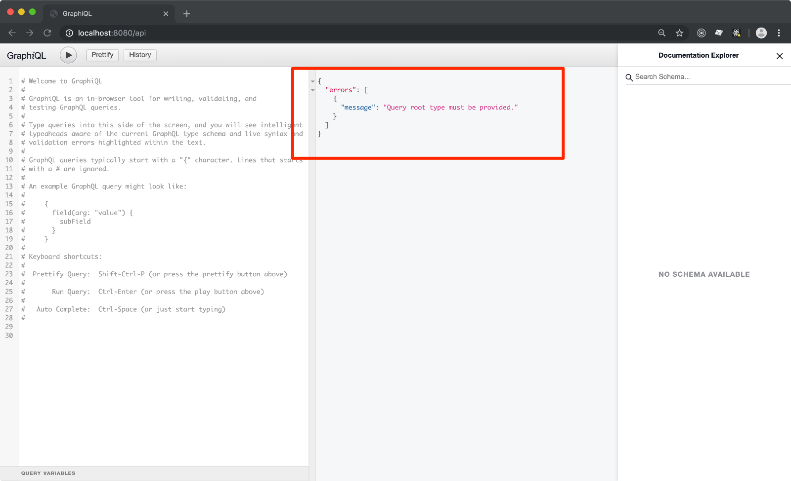

Facebook's crew didn't only come up with [React](https://reactjs.org/) and
[PropTypes](https://reactjs.org/docs/typechecking-with-proptypes.html)... they also produced
[GraphQL](https://graphql.org/)!

> GraphQL is to _REST Api_ what PropTypes is to _React Components' Props_

This is the simplest explanation to GraphQL that I came up with.<br>
You basically **describe the arguments to a particular request**, and you
**describe the output data structure**.

GraphQL provides 2 major benefits (plus many others):

- input/output schema validation
- fetch from multiple endpoints within a single request

Honestly, I hardly imagine working out an API without it. It's like the good ol'
[Json Schema](https://json-schema.org/) but on steroid.

---

Enough with the intro, in this tutorial you **learn how to set up a GraphQL API service**
in NodeJS, using [ExpressJS](https://expressjs.com/) and [ForrestJS' Hooks](https://marcopeg.com/2019/modular-node-apps-with-hooks).

> If you just want to see this in action, [download this tutorial codebase here](https://forrestjs.github.io/downloads/hooks-graphql.zip),<br>
> then run `yarn boot`.


## Step n.1 - Create a Hooks App

Initialize a new _NodeJS_ project (`yarn init`) then install the hooks:

```bash
yarn add @forrestjs/hooks
```

Then copy this [_Hooks_](https://marcopeg.com/2019/modular-node-apps-with-hooks) skeleton app into `index.js`:

```js
const { runHookApp } = require('@forrestjs/hooks')

runHookApp([ /* features go here */ ])
```

At last, you can run this app with `npx`:

```bash
NODE_ENV=development npx nodemon index.js
```

You might notice that... _nothing happens!_ 🤔

That's right, this is just an empty Hooks based app - for now - but we are about to turn this
into a working server with a _GraphQL_ enabled endpoint.

> 📌<br>It is quite important to set `NODE_ENV=development` to have some cool stuff
> available later in the tutorial. Stick with it for now.

## Step n.2 - Add ExpressJS Service

Running an _ExpressJS_ on _ForrestJS_ it's easier done than said.

> 📌<br>you want a better explanation of what we are about to do,<br>
> you may want to [checkout the _Hooks_ tutorial](https://marcopeg.com/2019/modular-node-apps-with-hooks) first.

First, install the service package:

```bash
yarn add @forrestjs/service-express
```

Then modify `index.js` to register the new service:

```js
runHookApp([
    require('@forrestjs/service-express'),
])
```

Run the app again and we notice that some kind of service is up and running on `8080`:


🤔 But if you try to navigate to `http://localhost:8080` you'll face bad luck:


That is because `@forrestjs/service-express` creates an _ExpressJS_ app for you all right,
but it doesn't provide any route to it.

> You are in charge of your business logic!

### 2b - Add your first route

It is up to you to **create a custom feature** and implement some your business logic,
here follows a super short tutorial on **how to create your first route**.

First, let's create a new _NodeJS_ module where to place this piece of logic:

```bash
vi home.route.js
```

And paste this code into it:

```js
const routeHome = ({ registerRoute }) =>
    registerRoute.get('/', (_, res) => res.send('Welcome!'))

module.exports = [ '$EXPRESS_ROUTE', routeHome ]
```

Believe it or not, this is a perfectly functional _ForrestJS_'s feature!

The next step is just to register it into your _Hooks App_:

```js
runHookApp([
    require('@forrestjs/service-express'),
    require('./home.route'),
])
```

Reload your `http://localhost:8080` and the magic is just blowing out your mind!


Of course, now you can add all the routes you may need, but let's stick to the plan and
move into _GraphQL_ service.

## Step n.3 - Add GraphQL

I guess you got the hang of it... Let' first install the _ForrestJS's_ package:

```bash
yarn add @forrestjs/service-express-graphql
```

Then register it into your App:

```js
const { runHookApp } = require('@forrestjs/hooks')

runHookApp([
    require('@forrestjs/service-express'),
    require('@forrestjs/service-express-graphql'),
    require('./home.route'),
])
```

This is still a very small codebase, but if you try to hit:

```
http://localhost:8080/api
```

Things start to look quite juicy:



**NOTE:** Don't be alarmed by the error, that happens because ForrestJS´s
GraphQL service does not provide any query out of the box. We are going to add
the very first query in the next paragraph.

The package `@forrestjs/service-express-graphq` does a couple of things just out of the box:

1. it mounts [`express-graphql`](https://github.com/graphql/express-graphql) on the `/api` route in your _ExpressJS_ service
2. activates _GraphiQL_ UI in development (that's why `NODE_ENV=development`)
3. it provides a new hook `$EXPRESS_GRAPHQL` that you can use to add your queries

> 📌<br>As with everything in _ForrestJS_, most of the default behaviours are fully configurable
> via the App's configuration or _Environment Variables_.

## Step n.4 - Add your own Queries and Mutations

There are plenty of _GraphQL_ tutorials out there, so here we will focus on writing
a simple query that shows how to use the `$EXPRESS_GRAPHQL` hook.

> 📌<br>
> I often suggest to **package your stuff as Hooks Features** as they will become easier to reuse,
> plus you will keep improving on the subject of
> [_Single Responsibility Principle_](https://en.wikipedia.org/wiki/Single_responsibility_principle) 😏

First, create a new _Feature_ and implement the `welcome` query:

```bash
vi welcome.query.js
```

And paste this code in it:

```js
const { GraphQLList, GraphQLString } = require('graphql')

const welcomeQueryHandler = (_, args, { req }) => [
    `Welcome, ${args.name}!`,
    req.protocol + '://' + req.get('host') + req.originalUrl,
]

const welcomeQuery = ({ registerQuery }) =>
    registerQuery('welcome', {
        description: 'Welcome the user',
        args: {
            name: {
                type: GraphQLString,
                defaultValue: 'user',
            },
        },
        type: new GraphQLList(GraphQLString),
        resolve: welcomeQueryHandler,
    })

module.exports = [ '$EXPRESS_GRAPHQL', welcomeQuery ]
```

Now it's just a matter of registering the new feature in your app:

```js
const { runHookApp } = require('@forrestjs/hooks')

runHookApp([
    require('@forrestjs/service-express'),
    require('@forrestjs/service-express-graphql'),
    require('./home.route'),
    require('./welcome.query'),
])
```

Reload your _GraphiQL_ and enjoy your new `welcome` endpoint:


**NOTE n.1:** The [`service-express-graphql`](https://github.com/forrestjs/forrestjs/tree/master/packages/service-express-graphql)
decorates the query's _context_ with the `req` and `res` objects from the
_ExpressJS_' middleware. This comes in handy if you plan to have some middlewares that
**add information into the request's context** and you plan to access them at resolve time.

**NOTE n.2:** Most of the time I even split the query's definition from the query's
implementation (the `resolve` function) into two separated modules. I do that mostly
because of testability, but in time it turns our a very good practice.

## Configuration - How to change the Endpoint name

Say you don't like `/api` as the endpoint for your GraphQL... say you'd prefer `/graphql`.

Here is how you can hook into the App's boot process and provide custom configuration:

```js
const { runHookApp } = require('@forrestjs/hooks')

runHookApp({
    settings: ({ setConfig }) => {
        setConfig('expressGraphql.mountPoint', '/graphql')
    },
    features: [
        require('@forrestjs/service-express'),
        require('@forrestjs/service-express-graphql'),
        require('./home.route'),
        require('./welcome.query'),
    ]
})
```

## Download

If you experienced any trouble following the steps above,
[download this tutorial codebase here](https://forrestjs.github.io/downloads/hooks-graphql.zip).

## Challenge

You now have all the basics components to play around with your ExpressJS app and GraphQL.

Can you build a **simple authentication system** so that a mutation will give you access
to some protected queries?

[Click here if you can't wait to play around with the Authentication layer](https://marcopeg.com/2019/simple-auth-in-graphql)

