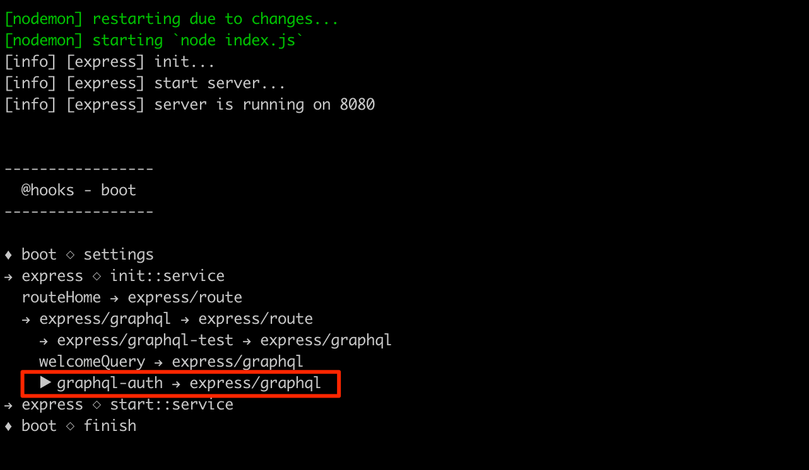

The official [GraphQL documentation](https://graphql.org/learn/authorization/) suggests putting the
authentication & authorization logic in the **business layer** of your application, leaving the
GraphQL completely unaware of it.

While I agree to do not bloat the GraphQL layer with a complex code and totally vouch for the idea of having
a **single source of truth** in the _business layer_, I think we can meet halfway and add some basic
mechanisms that will help to **protect our sensible queries and mutations** in a very simple fashion.

Imagine you could write something like this:

```gql
query {
    getGeneralInfo { temperature wind }
    ...

    auth {
        getPersonalInfo { name surname }
        ...
    }
}
```

The idea is that any query that we place inside the `auth` wrapper will be guarded by some
authentication & authorization logic. If the user doesn't have the right to access the `auth` wrapper,
then none of the sub-queries will be ever executed.

> I like to consider this approach a "High Order Components" applied to GraphQL.

🤘Let's get started already!

## PART 1 - The Codebase

We are going to build over the codebase from the [GraphQL Made Easy](https://marcopeg.com/2019/graphql-made-easy) tutorial.
You can [download it from here](https://forrestjs.github.io/downloads/hooks-graphql.zip).

We are also going to build a brand new **ForrestJS Feature** which is simply a folder that wraps all the source
files that are involved in providing this specific piece of building logic.

> 📌 Features use [ForrestJS Hooks](https://marcopeg.com/2019/modular-node-apps-with-hooks) to interact
> with each other and with the rest of the application.

I believe you are going to like the cleanliness of this approach 😎. So let's scaffold the basic files
that we are going to use:

```bash
mkdir ./grahpql-auth

# Feature's Entry Point
touch ./grahpql-auth/index.js

# Feature's Hooks Manifest
touch ./grahpql-auth/hooks.js
```

The **feature's manifest** has the responsibility to export all the hooks that can be extended by
other features. It looks like the React Redux's action names definition.

Copy this into `./grahpql-auth/hooks.js`:

```js
const { FEATURE } = require('@forrestjs/hooks')
exports.FEATURE_NAME = `${FEATURE} graphql-auth`
```

The **feature's entry point** has the responsibility to integrate
with the rest of the application and extending its capabilities.

Copy this into `./graphql-auth/index.js`:

```js
const hooks = require('./hooks')

const extendsGraphQLSchema = () => {
    console.log('we will extend the GraphQL schema')
}

module.exports = ({ registerHook, registerAction }) => {
    // Add any custom hooks into the App's context so that other features ca
    // refer to them as "$HOOK_NAME" (we will use this later on)
    registerHook(hooks)

    // Register an action to the GraphQL service's hook
    registerAction({
        hook: '$EXPRESS_GRAPHQL',
        name: hooks.FEATURE_NAME,
        handler: extendsGraphQLSchema,
    })
}
```

At last, we can open our App's entry point (`index.js`) and **register the new feature**:

```js
...
runHookApp([
    ...
    require('./graphql-auth'),
])
```

If everything works fine, you should see the `console.log` at boot time, but wouldn't it be
better if we had a way to **visualize how hooks interact with each other**?

Of course, the answer is _yes_!

## 🔔 bonus - How to add a Boot Trace

As we are working with the main entry point I suggest we register a small Hooks utility that
will help to visualize what is going on in our app at boot time:

```js
...
runHookApp({
    trace: true,
    settings: ({ setConfig }) => {
...
```

After your App restarts, you should be able to see the **hooks integration trace**, basically
the logical tree of **what hooks into what**:



You can read the row in the red box as:

> "graphql-auth" hooks into "express/graphql"


## GraphQL Wrapper, what is it?

We work now in `./graphql-auth/index.js` and play around with `extendsGraphQLSchema()` so to
create the `auth` wrapper as we have imagined it before:

```js
const { GraphQLObjectType, GraphQLString } = require('graphql')
const hooks = require('./hooks')

// Demo sub-query that provides some confidential informations:
const getPersonalInfo = {
    type: new GraphQLObjectType({
        name: 'PersonalInfo',
        fields: {
            name: { type: GraphQLString },
            surname: { type: GraphQLString },
        },
    }),
    resolve: () => ({
        name: 'Marco',
        surname: 'Pegoraro',
    })
}

// GraphQL shape of the `auth` wrapper, here we can add the
// protected sub-queries:
const AuthQuery = new GraphQLObjectType({
    name: 'AuthQuery',
    fields: { getPersonalInfo },
})

// A function that somehow defines whether the `auth` wrapper should
// be accessible or not. "null" means "no", "true" means "yes".
//
// --> This is the critical piece of logic! <--
const canAccessAuth = () => true

const extendsGraphQLSchema = ({ registerQuery }) => {
    registerQuery('auth', {
        type: AuthQuery,
        resolve: canAccessAuth,
    })
}

module.exports = ({ registerHook, registerAction }) => {
    registerHook(hooks)
    registerAction({
        hook: '$EXPRESS_GRAPHQL',
        name: hooks.FEATURE_NAME,
        handler: extendsGraphQLSchema,
    })
}
```

In the code above we extend the App's GraphQL schema with a new `auth` query and we
populate this object with a _sub-query_ `getPersonalInfo` which **should return sensible data**
and so it should be protected.

Try to run:

```gql
query {
    auth {
        getPersonalInfo { name }
    }
}
```

You should be able to read `Marco`:

```json
{
  "data": {
    "auth": {
      "getPersonalInfo": {
        "name": "Marco"
      }
    }
  }
}
```

Try now to change the "authorization logic" so to deny access:

```js
const canAccessAuth = () => null
```

and run the query again... Nothing! The whole `auth` returns just `null`:

```json
{
  "data": {
    "auth": null
  }
}
```

> 📌 By forcing a `null` value into a nullable GraphQL query, we force GraphQL to
> **skip the resolution of any sub-query**.

And this is our **simple strategy** that regulates access to some critical queries!

#### ✅ Strengths:

- queries nested inside the `auth` wrapper doesn't need to implement any protection logic
- `canAccessAuth` works like an _Express middleware_ which is a widely adopted concept
- it is possible to deep-nest more wrappers that implement fine-grained data-access policies

#### 🔸Limitations:

- only the access to `auth` is regulated, a more fine-grained regulation must be implemented
  query by query
- you might not like the shape of the API, but this is personal and I hope you like it anyway 😇


## PART II - Make it Reusable

From now on, we will work on refining the code above and implement two important responsibilities:

1. Make this "auth wrapper" extensible so that other features can register some protected routes
2. Implement the `canAccessAuth` with some real (but still simple) protection mechanism

So, in the end, the GraphQL crew were right, we will implement the authentication/authorization logic
in the business layer, but **we do abstract it away from most of our codebase** thanks to a simple GraphQL wrapper.

## Create an Extensible Feature

Code reusability is a big deal of a problem, and _ForrestJS' Hooks_ aim to improve the
chances to produce some really reusable features. In order to make `graphql-auth` truly
reusable we are going to:

- split responsibilities into isolated modules
- create some extension points (hooks)

### Step n.1 - Isolate "extendsGraphQLSchema"

Now we can really focus on the extensibility task. The first step is to create a new hook
definition in `./graphql-auth/hooks.js` so that other features can import it:

```js
const { FEATURE } = require('@forrestjs/hooks')
exports.FEATURE_NAME = `${FEATURE} graphql-auth`
exports.GRAPHQL_AUTH = `${exports.FEATURE_NAME}/queries`
```

then create the actual module:

```bash
vi ./graphql-auth/graphql-schema.js
```

and paste:

```js
const { GraphQLObjectType, GraphQLID } = require('graphql')
const { GRAPHQL_AUTH } = require('./hooks')

// We will work on this very soon
const canAccessAuth = () => true

exports.extendsGraphQLSchema = ({ registerQuery, registerMutation }, { createHook }) => {
    // Collect queries and mutations that needs session validation
    const queries = {}
    const mutations = {}
    const args = {
        token: {
            type: GraphQLID,
        }
    }

    // Let other features integrate their own queries and mutations.
    // It is always a good idea to provide getters/setters to the extensions
    // so to retain full control over the internal data structure:
    createHook(GRAPHQL_AUTH, {
        args: {
            registerQuery: (name, def) => queries[name] = def,
            registerMutation: (name, def) => mutations[name] = def,
            setArg: (key, val) => args[key] = val,
        },
    })

    // Extends the app's queries with the "auth" wrapper
    // (only if at least one query was registered)
    Object.keys(queries).length && registerQuery('auth', {
        args,
        type: new GraphQLObjectType({
            name: 'AuthQueryWrapper',
            fields: queries,
        }),
        resolve: canAccessAuth,
    })

    // Extends the app's mutations with the "auth" wrapper
    // (only if at least one mutation was registered)
    Object.keys(mutations).length && registerMutation('auth', {
        args,
        type: new GraphQLObjectType({
            name: 'AuthMutationWrapper',
            fields: mutations,
        }),
        resolve: canAccessAuth,
    })
}
```

The magic happens with the `createHook(GRAPHQL_AUTH, ...)` instruction. Here we pass down
**some setter methods** so that other features can inject their own queries, mutations, and arguments.

The thing with the `Object.keys()...` is a simple conditional statement: GraphQL requires `GraphQLObjectType`
to have at least one field. But we start with an empty set of queries and mutations and don't know if any
feature will actually register anything in them.

> So we need to skip injecting the `auth` wrapper in case there are no sub-queries available.

**NOTE:** You might have noticed that we create an **optional argument** `token` that is then
applied to both queries and mutations. Plus we let any registered extension the possibility to
extend the `args` as they wish. This is actually a simple preparation step for the next chapter.

### Step n.2 - Refactor the Entry Point

Now that we have the `graphql-schema` module, the entry point becomes dramatically simple:

```js
const hooks = require('./hooks')
const { extendsGraphQLSchema } = require('./graphql-schema')

module.exports = ({ registerHook, registerAction }) => {
    registerHook(hooks)
    registerAction({
        hook: '$EXPRESS_GRAPHQL',
        name: hooks.FEATURE_NAME,
        handler: extendsGraphQLSchema,
    })
}
```

> Mind that we will work some more on this file in order to hack into the _Express middlewares_
> when we will implement a real protection business logic.

### Step n.3 - Register the "getPersonalInfo" query

I'm sure you will like this step.

Our `graphql-auth` is now a good example of an extensible _ForrestJS feature_ and we can move the
`getPersonalInfo` fake query in the main app's folder, and just register it as a generic
App's extension as we did already for the `welcome.query.js`.

create the extension's file:

```bash
vi ./get-personal-info.query.js
```

then paste:

```js
const { GraphQLObjectType, GraphQLString } = require('graphql')

// Fake resolver, this should connect to some dbms and fetch
// very sensible data!
const resolve = () => ({
    name: 'Marco',
    surname: 'Pegoraro',
})

// Shape the GraphQL Type for our sensible data:
const GraphQLPesonalInfo = new GraphQLObjectType({
    name: 'PersonalInfo',
    fields: {
        name: { type: GraphQLString },
        surname: { type: GraphQLString },
    },
})

// Register the sensible query into the "auth" hook:
module.exports = [
    '$GRAPHQL_AUTH',
    ({ registerQuery }) => registerQuery('getPersonalInfo', {
        type: GraphQLPesonalInfo,
        resolve,
    }),
]
```

And register the extension into `./index.js`:

```js
...
runHookApp([
    ...
    require('./graphql-auth'),
    require('./get-personal-info.query'),
])
```

I encourage you to play and toggle the `require('./get-personal-info.query')` instruction and
investigate the GraphQLi docs, so to notice that the whole `auth` wrapper will disappear
as soon as you remove this demo extension.

If everything works then **you have just created your first extensible feature** (or is it a service?)
and a custom implementation of your own hook!

Congrats 👍


## Implement the Auth Business Logic

It's finally time to play around the `canAccessAuth()` function in `./graphql-auth/graphql-schema.js`,
and refactor it into a standard GraphQL resolver:

```js
const canAccessAuth = (_, args, { req }) =>
    req.authValidateToken(args) ? true : null
```

It is minimalistic and I actually mean to keep it like this.
The [SRP](https://en.wikipedia.org/wiki/Single_responsibility_principle) here is to translate
between GraphQL and the language of our _business logic_.

The real _business logic_ belongs to `validateAuthToken`, and **Express middleware** that we
are about to write as the second extension of our `graphql-auth` feature.

Create:

```bash
vi ./graph-auth/auth-middleware.js
```

and paste:

```js
// This is just the scaffolding of a ForrestJS Hook's handler
exports.authMiddleware = () => {}
```

then register this extension right away in `./graphql-auth/index.js`:

```js
const hooks = require('./hooks')
const { extendsGraphQLSchema } = require('./graphql-schema')
const { authMiddleware } = require('./auth-middleware')

module.exports = ({ registerHook, registerAction }) => {
    registerHook(hooks)
    registerAction({
        hook: '$EXPRESS_GRAPHQL',
        name: hooks.FEATURE_NAME,
        handler: extendsGraphQLSchema,
    })
    registerAction({
        hook: '$EXPRESS_GRAPHQL_MIDDLEWARE',
        name: hooks.FEATURE_NAME,
        handler: authMiddleware,
    })
}
```

As we see this extension hooks into `EXPRESS_GRAPHQL_MIDDLEWARE`, which gives us a helper
function that let us push a new middleware into the GraphQL's mountPoint route.

We can now focus on the middleware implementation:

```js
exports.authMiddleware = ({ registerMiddleware }) =>
    registerMiddleware((req, res, next) => {
        req.authValidateToken = args => args.token === 'xxx'
        next()
    })
```

This is just a first static implementation. The "password" is hardcoded and this solution
is definitely not extensible. We are going to improve this soon enough, but for now, why don't
you try to run those queries:

```gql
query GoodQuery {
    auth (token: "xxx") {
        getPersonalInfo { name }
    }
}

query BadQuery {
    auth {
        getPersonalInfo { name }
    }
}
```

The first query should yield the full response, the second should yield `data.auth = null`.
If this is the case, you are ready to move to the next chapter and work on this function
some more so to make it versatile and extensible.

- Wouldn't be cool to authorize a request based on headers?
- Wouldn't be cool to let a custom extension completely change the authorization logic?

Spoiler alert: _it is cool_.

## Make it a Service

In ForrestJS's land, there are **features** and **services**. They look like the same and
you write them in the exact same way. So you already know how to build services.

But they have a different meaning.

A **FEATURE** is project-specific and implements stuff that your customer (or yourself)
are happy to pay for. It is also unusual that you will ever share a feature across
two different projects.

A **SERVICE** is totally general. Your customer doesn't want to pay for it and she likely
doesn't understand anything of it (too abstract). You have already used some generic
ForrestJS's services like `@forrestjs/service-express`. You also clearly want to share
those kinds of stuff across your projects. Services probably belong to _NPM_.

In this chapter we will:

- increase the capabilities of our Auth middleware
- make it generic and extensible to the point that we are happy to call it a service

It actually makes sense because we are simply building a "guarded wrapper" for GraphQL
queries... What could be more generic than that?

### An Extensible Middleware

First thing let's add a new hook name to the service's manifest `./graphql-auth/hooks.js`:

```js
...
exports.GRAPHQL_VALIDATE = `${exports.FEATURE_NAME}/validate`
```

And then copy this slightly more sophisticated implementation of the middleware in
`./graphql-auth/auth-middleware.js`:

```js
const hooks = require('./hooks')

exports.authMiddleware = ({ registerMiddleware }, { getConfig, createHook }) => {
    // 1. Enforce settings and fail at boot time
    const validToken = getConfig('authToken', process.env.GRAPHQL_AUTH_TOKEN)

    // 2. Let other extensions mess up with the Business Logic
    let validateRequest = null
    let validateToken = null

    createHook.sync(hooks.GRAPHQL_VALIDATE, {
        setValidateRequest: fn => validateRequest = fn,
        setValidateToken: fn => validateToken = fn,
    })

    // 3. Provide a default Business Logic
    validateRequest = validateRequest || (req => {
        try {
            req.authToken = req.headers.authorization.substr(7)
            req.authTokenIsValid = req.authToken === validToken
        } catch (err) {
            req.authToken = null
            req.authTokenIsValid = false
        }
    })

    validateToken = validateToken || ((req, { token }) => {
        if (token) {
            req.authToken = token
            req.authTokenIsValid = token === validToken
        }
        return req.authTokenIsValid
    })

    // 4. Create the middleware
    registerMiddleware((req, res, next) => {
        validateRequest(req)
        req.authValidateToken = args => validateToken(req, args)
        next()
    })
}
```

There are a few interesting things going on here:

**Point n.1:** Crash fast. If your feature or service depends on a setting or _environment variable_,
it is good practice to **validate it at boot time**.

> I've been through lot of hicups because of unvalidated settings that were used in some obscure
> and seldom used corner cases.

The function `getConfig()` is part of the `createHooksApp()` context and provides a simple interface
for accessing configuration values.

**Point n.2:** Let extensions take over. The trick is to provide extensions with "setter" functions
that can be used to affect some internal logic. Those setters could implement some type check and
throw errors if misused by extensions. It makes it for a very neat API.

**Point n.3:** Provide a default business logic in case of no extension register into this particular hook.

**Point n.4:** Implement the _ExpressJS Middleware_. No big deal here, you know how to handle this.

## Configuration Made Easy

> this might become a standalone tutorial!

If you run the App with the latest implementation of `./graphql-auth/auth-middleware.js` you will
surely notice that it crashes due to the missing `settings.authToken` or `process.env.GRAPHQL_AUTH_TOKEN`.

We need to provide that information, and here are a couple of ways to achieve so.

### App's Configuration

The easiest approach is to provide a static piece of configuration in `./index.js`:

```json
...
runHookApp({
    trace: true,
    settings: ({ setConfig }) => {
        setConfig('expressGraphql.mountPoint', '/graphql')
        setConfig('authToken', 'xxx')
    },
...
```

But, of course, we wouldn't really like to hard code values like that, so let's investigate a different approach.

### Runtime ENV Variable

We can provide the value at boot-time:

```bash
GRAPHQL_AUTH_TOKEN=xxx yarn start
```

This way the token is highly dynamic, but we would need to remember it every time... which is suboptimal,
to say the less.

### ENV File to Rescue

A common practice is to use `.env` files to list boot-time environment variables. It really makes things easy for us.

Our `.env` file looks like this:

```bash
vi .env
```

and paste:

```bash
GRAPHQL_AUTH_TOKEN=xxx
ANOTHER_VAR=yyy
YET_ANOTHER="hoho"
```

Now the big deal is **how to read this file** so that we could access the values as:

```js
process.env.GRAPHQL_AUTH_TOKEN
```

There are plenty of _NPM packages_ that help you in this task, but as we are using
_ForrestJS_, we can simply add the `@forrestjs/service-env` that wraps one of those
modules and integrates with `runHookApp()`:

```bash
yarn add @forrestjs/service-env
```

Then edit `./index.js` as:

```js
const { runHookApp } = require('@forrestjs/hooks')

runHookApp({
    trace: true,
    settings: ({ setConfig }) => {
        setConfig('expressGraphql.mountPoint', '/graphql')
    },
    services: [
        require('@forrestjs/service-env'),
        require('@forrestjs/service-express'),
        require('@forrestjs/service-express-graphql'),
        require('./graphql-auth'),
    ],
    features: [
        require('./home.route'),
        require('./welcome.query'),
        require('./get-personal-info.query'),
    ]
})
```

You notice that we split our extensions into two groups: `services` and `features`. We have introduced
some notions about the differences between them, but at a very high level we can say that
`services` can hook into extensions point that `features` can not.

When it comes to the `service-env`, it can run some logic even before the `SETTINGS` hook fires up.

The separation between `services` and `features` will also help you to clarify **what is really
relevant for your project's business value**, and what is just infrastructural stuff.

## Takeaways

This was a long tutorial, I hope you survived to it! Anyway, the relevant takeaways that you may
want to explore in more details are:

- how to create GraphQL Extensible Wrappers
- how to delegate Business Logic outside the GraphQL layer
- how to build extensible features/services by offering hooks

## Download

If you experienced any trouble following the steps above,
[download this tutorial codebase here](https://forrestjs.github.io/downloads/hooks-graphql-auth.zip).

## Challenge

Can you create an extension to this feature that allows to **log-in** and persists the
"logged in" status in a cookie?

