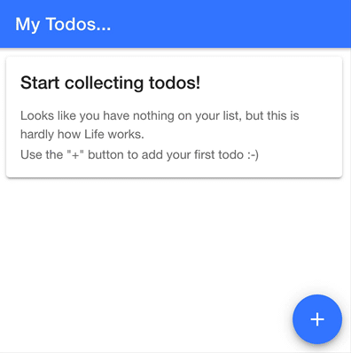

    

This is the best possible time to **become a developer**!

In a [previous article](/2019/online-ide-for-learning-how-to-code) you learned about [Repl.it](https://repl.it) and [CodeSandbox.io](https://codesandbox.io) that you can use to experiment with backend and frontend projects.

Today you will take a step forward and create a **Full Stack Todo List App** that persists data in a _Postgres_ database using [ElephantSQL](https://www.elephantsql.com/) which offers a **free Postgres plan** where you can store up to 20Mb of data. Perfect solution for learning.

&nbsp;

## Let's plan the Project:

### 📝Data Storage

The first step is to set up an account in ElephantSQL and create a new free database plan that this app will use. 

This is mostly achieved by clicking around the Web Admin area in ElephantSQL and I will walk you through each step with annotated screenshots.

👉[Go to the Free Postgres tutorial](/2019/setup-free-postgres)

### 📡Backend

Next comes the backend. As you want to learn Javascript, you will use Repl.it to create a NodeJS backend that **connects to your database** and offers a **_REST API_** toward the Internet.

> You will be pleasantly surprised when you'll see that it takes just a small Javascript file
> to achieve all of this... well... a "basic all of this"...

👉[Go to the NodeJS Backend in the Browser tutorial](/2019/nodejs-backend-on-repl-it)

### 📱Frontend

The last step is to create the UI for your app. The User Interface is often the most time expensive part of any Software Engineering projects, and the Todo App is no exception.

You will use the React boilerplate provided by CodeSandbox.io and learn how to use React's Hooks to **handle a global application state capable of consuming the REST API** prepared during the previous step.

With that in place, you will use [Ionic/React](https://ionicframework.com/docs/react) to assemly a **nice looking mobile first** UI.

👉[Go to the React development experience in the Browser tutorial](/2019/react-frontend-on-code-sandbox) - still work in progress...
