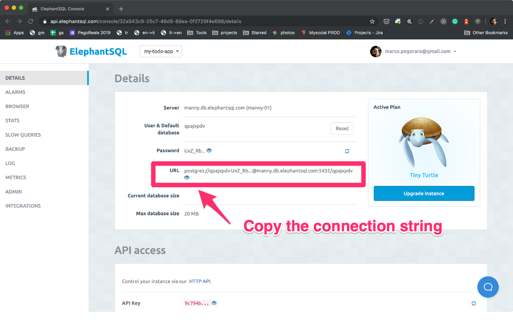
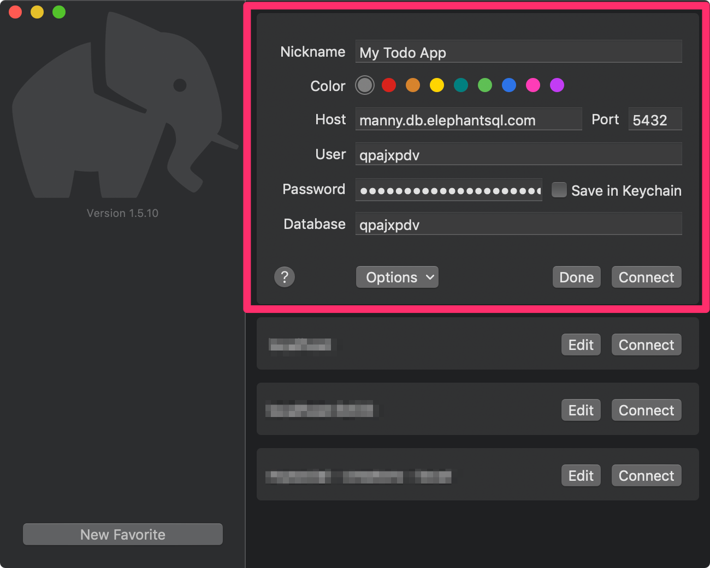
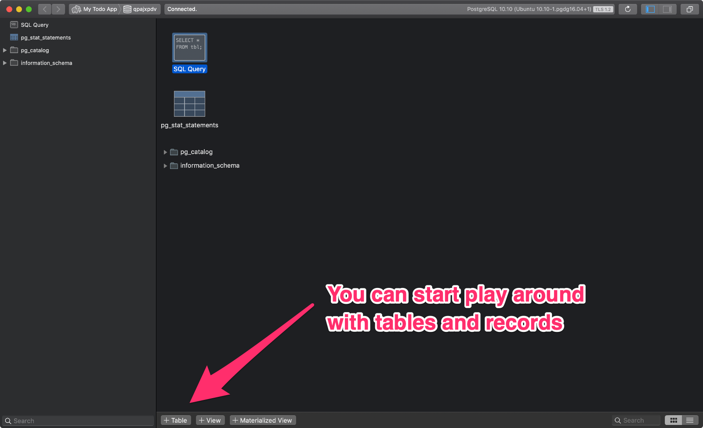
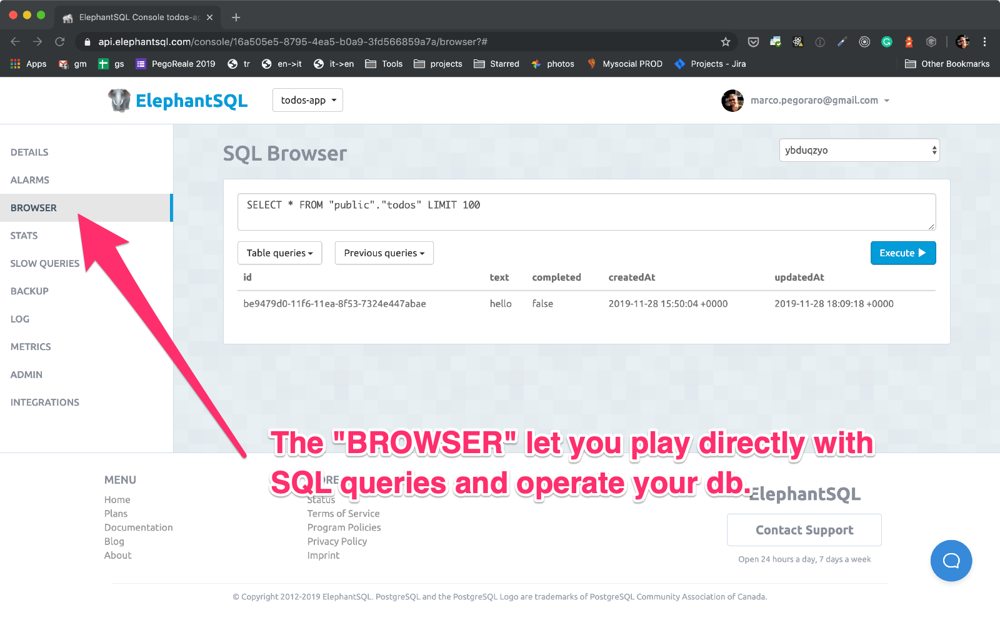

> This article is the first part of the [Free Full-Stack development in your Browser](/2019/free-browser-full-stack) trilogy, **learn how to build a modern _PWA_** using your browser and some unbelievable free tools!

[PostgreSQL](https://www.postgresql.org/) is a great tool, it offers:

- relational database paradigm (SQL)
- document database paradigm
- stored procedures
- table inheritance and data partitioning
- lot of extensions
- event emitter!!!

In the [Free Full-Stack development in your Browser](/2019/free-browser-full-stack) tutorial you are going to use just one simple "todos" table and all the _SQL_ work is going to be handled by a data modeling library called [Sequelize](https://sequelize.org/).

In this part of the tutorial you will create an account in [ElephantSQL](https://www.elephantsql.com/) and set up a new database.

## Go to the ElephantSQL Website

Open your browser and go to [www.elephantsql.com](https://www.elephantsql.com/). Once there
you can follow the steps in this video to login with _Google_ or _GitHub_ and create your
first free _Postgres_ database:

`youtube: https://youtu.be/3MZ_e_pST8g`

Later in the tutorial you will need the **Postgres Connection String** for your app to establish a successful connection with the database.

ElephantSQL provides this information for you as a **URL**:

## Play with your Database

Before you dig into back-end code I'd like you to play around with your database and spend some time to get familiar with simple opertions such creating tables, inserting, changind and deleting data.

This is often refferred to as **CRUD Operations** and it is exactly what you will do in your backend. If you have a direct experience with it is going to be easier.

## Use Postico on MacOS

I'm a MacOS user and the client I suggest you to use is [Postico](https://eggerapps.at/postico/) which works fine and it is free of charge for most of its functionalities.

In the next screenshot you can see my connection setup screen:

And once you establish a succesfull connection, you can use the app to perform all the operations that you may think about.

## Or use the SQL Browser in ElephantDB

In case you can't use a Postgres client app, you can navigate to the **BROWSER** menu and use the console to **run SQL queries** against your database.

If you are going the "browser" way you need to write plain _SQL queries_, here is a nice [introduction to the subject that will get you up to speed with _CRUD_ operations in _SQL_ for Postgres](https://www.datacamp.com/community/tutorials/beginners-introduction-postgresql).

## The Next Step

👉 Move to the backend!
