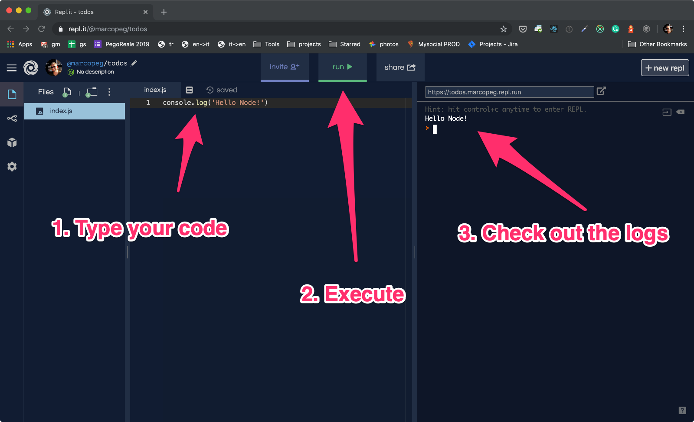
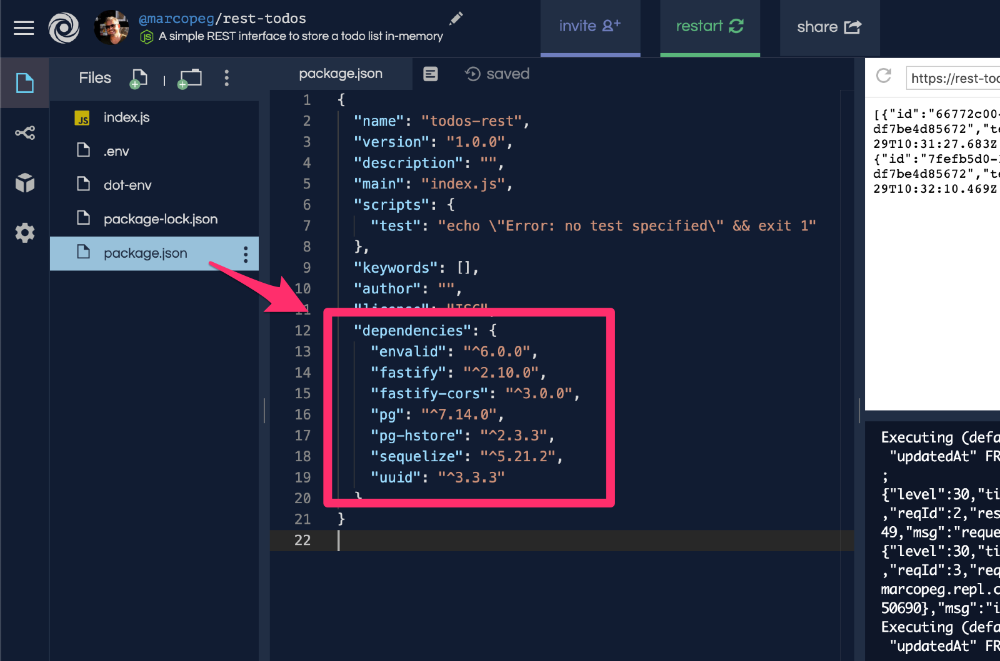
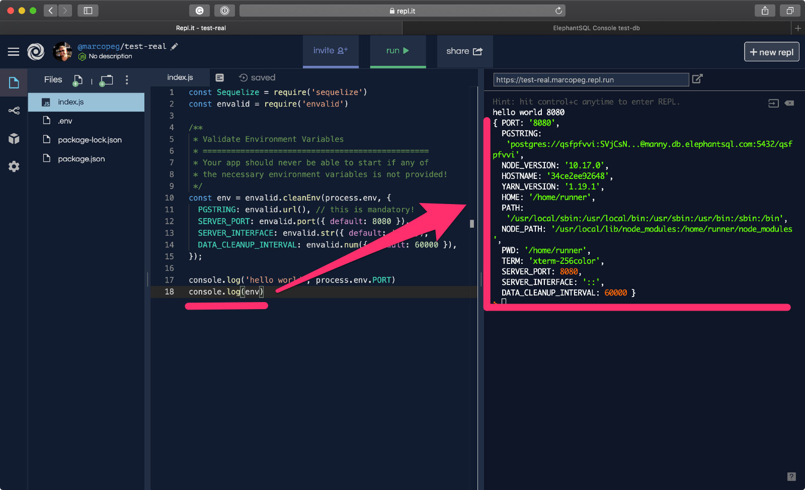

> This article is the second part of the [Free Full-Stack development in your Browser](/2019/free-browser-full-stack) trilogy, **learn how to build a modern _PWA_** using your browser and some unbelievable free tools!

<p style="border-bottom: 1px solid #ddd"></p>

Now that your database is up and running it's time to **write a backend service** that acts like a middle-man between the App's UI and the data-layer.

Don't you worry, it is easier done that said. But first we need to make a reasonable plan of what we want to achieve with this component. Basically you should **write your user stories** and refine them before you start coding.

The backend service should:

1. connect with the database
2. implement a **data model** to represent todos
3. expose a REST API as a server that is reachable from the Internet

You are going to use [Repl.it](https://repl.it) as backend playground.

Once you get to the website, follow this short video to create your account and kick-off your first _REPL.it_ project:

`youtube: https://youtu.be/hDfd6YMHjIE`

At this point you land in your new project's page that should look more or less like this:



### Add NPM Dependencies

Your backend project is going to use a few **NPM Dependencies** to facilitate the task, and _REPL_ makes it even easier for you with the **dependency manager UI**.

Follow this video to learn how to add a new dependency:

`youtube: https://youtu.be/nU0V1KkLA84`

Then make sure that your project has the following dependencies correctly installed:

- pg
- pg-hstore
- sequelize
- uuid
- envalid
- fastify
- fastify-cors

Once you are done, open your `package.json` file to check that all the required dependencies are in place:



### Validate Environment Variables

REPL.it allows you to create a `.env` file where to **store run-time settings that may be sensitive** like a database connection string. You need you App to know the password, but you don't want the rest of the world to see it!

An environment variable file is simply a list of informations written as `KEY=value` with one definition per line. You can then access those values in your _NodeJS_ App as `process.env.KEY` as shown in this short video:

`youtube: https://youtu.be/TeBavGhpCUU``

Environment variables are often critical to the correct beavior of your application. If you forget to provide one of those variables, your App may behave unexpectedly.

If you want to provide a high quality codebase, I suggest you validate all your environment variables at boot time, providing nice error messages in case something goes wrong.

In the following video I use [envalid](https://www.npmjs.com/package/envalid) to achieve this:

`youtube: https://youtu.be/j_8AYxyadZc`

You are going to build a solid micro-service so you will need a few variables for that. The cool thing with **envalid** is that you can use it for validation purpose as well for **setting default values** when an optional environment variable is not provided:

```js
const env = envalid.cleanEnv(process.env, {
  PGSTRING: envalid.url(), // this is mandatory!
  SERVER_PORT: envalid.port({ default: 8080 }),
  SERVER_INTERFACE: envalid.str({ default: "::" }),
  DATA_CLEANUP_INTERVAL: envalid.num({ default: 60000 })
});
```

Once you are done writing your environment validation and defaults you can `console.log` the result and observe something like this:



There are way more variables than you defined! That's because _NodeJS_ already provides you with many informations regarding the system that your App is running on.

### Expose a REST API Server

The goal of your backend service is to support your frontend (you are going to create a cool React App) and one way to achieve this is to offer [REST API](https://restfulapi.net/).

There are many ways to do so, and many different frameworks that make your life easier. One of them is [Fastify](https://fastify.io) which facilitates the creation of an _HTTP Server_ and comes prepared for security and performances so you can sleep tight(er) at night.

This video demonstrates how easy it is to kick-off your server and distribute contentes over the Internet:

`youtube: https://youtu.be/u9iopnFK288`

There are two distinct parts in this code session:

1. service configuration
2. service boot

The configuration is a **synchronous javascript** piece of code that simply imports the _Fastify_ library and setup the first route. The following piece of code is basically the "hello world" example that you can find on the Fastify's documentation page:

```js
const fastify = require("fastify");
const server = fastify({ logger: true });
server.get("/", async () => "Hello World!");
```

But then you want to kick-off this service, and that part deals with **NodeJS's network API that are asynchronous**. It simply means that things can go wrong and NodeJS can't even tell how long it will take to know. For that reason NodeJS will handle similar situations with [Promises](https://developer.mozilla.org/en-US/docs/Web/JavaScript/Reference/Global_Objects/Promise) and we will handle them in a modern fashion using [async/await](https://medium.com/javascript-in-plain-english/async-await-javascript-5038668ec6eb).

Long story short, you need to wrap your asynchronous logic into an asynchronous function, and call it:

```js
const boot = async () => {
  await server.listen(env.SERVER_PORT, env.SERVER_INTERFACE);
};

boot();
```

A more sophisticated way to write the same code using [immediate functions](https://blog.kevinchisholm.com/javascript/javascript-immediate-functions-basics/) would be:

```js
(async () => {
  try {
    await server.listen(env.SERVER_PORT, env.SERVER_INTERFACE);
  } catch (err) {
    console.error(err);
  }
})();
```

You may see similar code in many projects, it's just a weird syntax for defining a function and calling it right away. It looks complicated but it is not, it's just a matter of getting used to it. **Truth is, with immediate functions you can simplify many nasty conditionals and switches!**

### Handling the Database

It's now time to establish a connection with the database and handle a `todos` folder where you can safely store data.

You are going to use [Sequelize](https://sequelize.org/), a good _ORM_ for Postgres, MySQL and more. This library lets you describe your data and then provides you with simple Javascript methods to perform the most common operations. You are not going to write a single line of \_SQL: in this tutorial!

The aforementioned "description of your data" is called **model** and once defined, you are going to use it to interact with the database. In the next step you will work on the _REST API_ again to connect an _HTTP Request_ with a _Data Action_ using the model itself.

For this reason you must setup your database stuff before the _Fastify_ logic as in this short video:

`youtube: https://youtu.be/ZT3Rjg_V2hs`

When it comes to coding, you can split this video in 3 steps.

Step n.1 is to create a Sequelize client as in the following snippet. Just remember that `env.PGSTRING` comes from the environment validation step.

Also, I recommend you set up the **connection pooling** to open max connection toward your database. ElephantSQL free instances accept up to 5 connections, but I've gotten in trouble while reloading my scripts sometime, **limiting the pooling to 1 is a safe development setting**, even if it would be slow and unreliable in production.

```js
const Sequelize = require("sequelize");
const db = new Sequelize(env.PGSTRING, { pool: { max: 1 } });
```

Step n.2 is to **create a data model** for our todos. You can read a lot about it in the [Sequelize documentation page](https://sequelize.org/v5/manual/getting-started.html#modeling-a-table), just think of a data model as a utility that helps you define a Postgres table and read/write data to it:

```js
const Todo = db.define("todo", {
  id: {
    type: Sequelize.UUID,
    allowNull: false,
    primaryKey: true
  },
  text: {
    type: Sequelize.TEXT,
    allowNull: false
  },
  completed: {
    type: Sequelize.BOOLEAN,
    allowNull: false,
    defaultValue: false
  }
});
```

Finally, in Step n.3 you can hook into your App's boot function, await for a successful connection to be established and for your data model to be in place:

```js
await db.authenticate();
await Todo.sync();
```

I normally await for my database connection to be up and running **before I start the server**, so that when the system is ready to accept requests, everything will be in place to answer.

### Expose the Todos REST Api

Once the connection and the model are in place, you can move on and expose a few HTTP endpoints to let a UI (or other services) to interact with your data:

`youtube: https://youtu.be/3t-hedFHPC4`

As this is a purely demonstrational tutorial, you are going to use the very basic _Fastify_ functionalities and **expose your data model through _CRUD REST API_**.

In production, you would certainly need to add some form of protection layer, to authenticate requests and decide who gets to read and write. Just keep this in mind!

```js
// read all entries sorted, last created at the bottom
server.get("/", () =>
  Todo.findAll({
    order: [["createdAt", "ASC"]]
  })
);

// add a new entry, it calculates a universal unique id
server.post("/", req =>
  Todo.create({
    ...req.body,
    id: uuid(),
    completed: false
  })
);

// updates an existing entry by id
server.put(`/:id`, req =>
  Todo.update(req.body, {
    where: req.params,
    returning: true
  })
);

// deletes an existing entry by id
server.delete("/:id", req =>
  Todo.destroy({
    where: req.params
  })
);
```

The code above heavily relies on [**arrow functions**](https://developer.mozilla.org/en-US/docs/Web/JavaScript/Reference/Functions/Arrow_functions) to keep it short and expressive.

If you are not very familiar with it, here it comes the update functionality written in old fashioned `function` syntax:

```js
// Define the Fastify route handler:
function handleTodoUpdate(req) {
  // extract the ID from the request's URL params:
  const todoId = req.body.id;

  // create the database query options object that will
  // tell Sequelize how to target the correct record:
  const queryOptions = {
    where: {
      id: todoId
    }
  };

  // trigger the UPDATE query on the "todos" table in the
  // Postgres database.

  // This operation is asynchronous and returns a "promise" so
  // we pass that promise to the Fastify that will automatically
  // send the results as JSON encoded HTTP Response.
  return Todo.update(req.body, queryOptions);
}

// Declare a Fastify params based route and connect it to the
// route's handler that we previously declared:
server.put("/:id", handleTodoUpdate);
```

Of course, you are free to write code the way you want, but I really believe that **arrow functions** make our developer life much easier!

### 🧨 IMPORTANT !! Open up _CORS_ !!

This is a delicate step even if the code change that you are about to do is dramatically simple:

```js
const cors = require("fastify-cors");

const server = fastify({ logger: true });
server.register(cors); // this is the new line!
```

It's delicate because **it involves security** and I really don't want to give away bad examples or easy shortcut that you may take to production one day. But on the other side, I need to keep this code example as simple as possible for the purpose of a full-stack tutorial!

**So what is _CORS_?**

As you can read on the [MDN CORS documentation page](https://developer.mozilla.org/en-US/docs/Web/HTTP/CORS) _CORS_ is a mechanism to restrict the access to server-side resources of a Web App.

A simple Web App is served out from it's own server (where the `index.html` file is hosted) and has default permission to "talk back" to that server using its REST API to load or change data.

In the situation where the backend and the client are produced by different servers, you need to provide more configuration to make things work.

```js
server.register(cors);
```

This simple line tells your _Fastify_ server to accept requests from any possible origin. Basically **it completely removes the security layer** aforementioned.

You need this in your code because the _REST API_ of your full-stack app is served by `https://repl.it`, but your frontend server will be served by `https://codesandbox.io`. Those are **two different origins** and by default wouldn't be able to talk with each other.

**IMPORTANT:** Just keep in mind that this tutorial drives you through a _PROOF OF CONCEPT_ and **it is not meant to be taken into production!**
