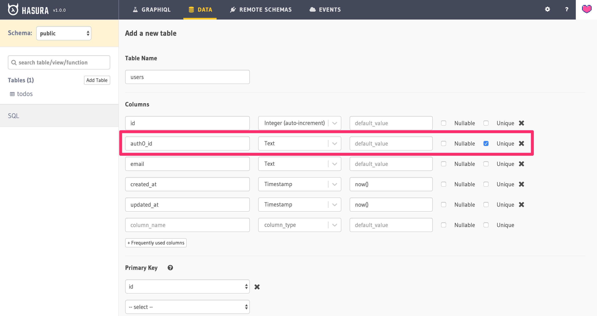
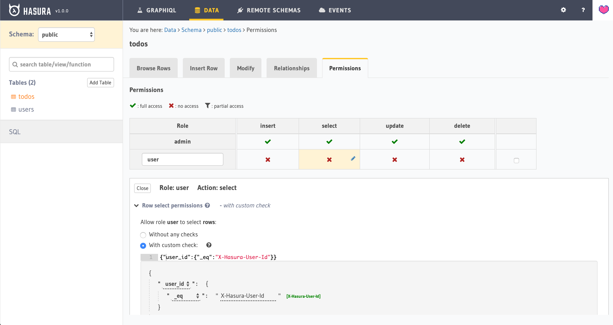
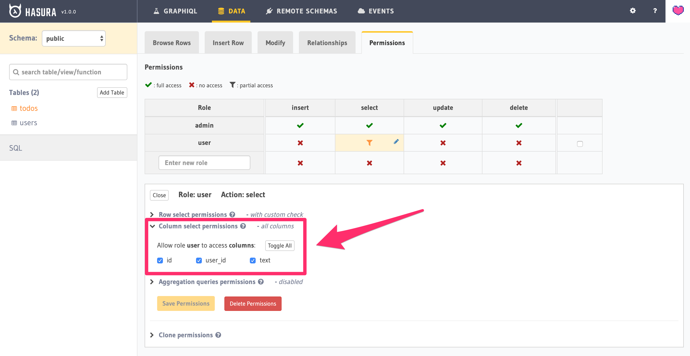
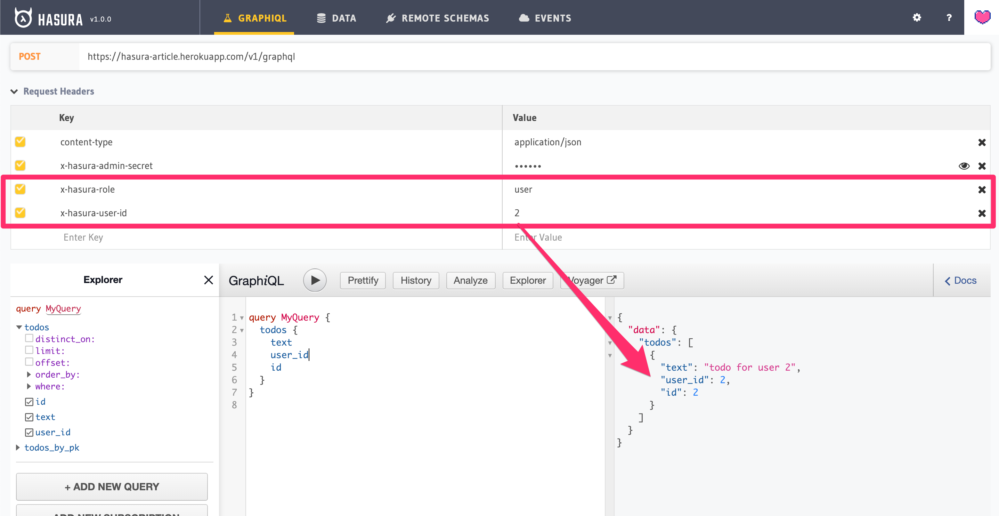
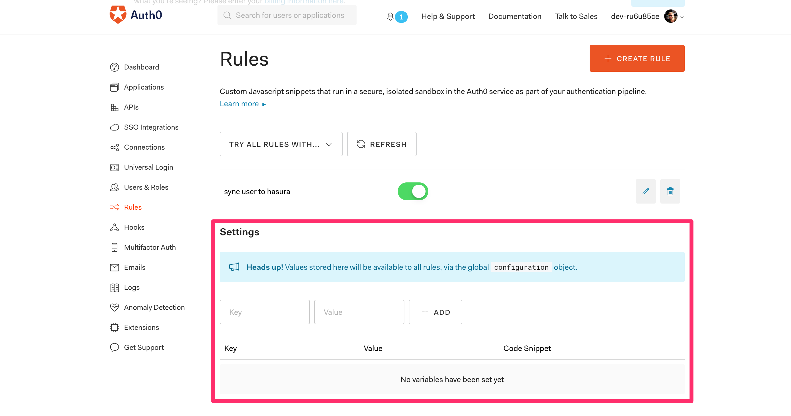
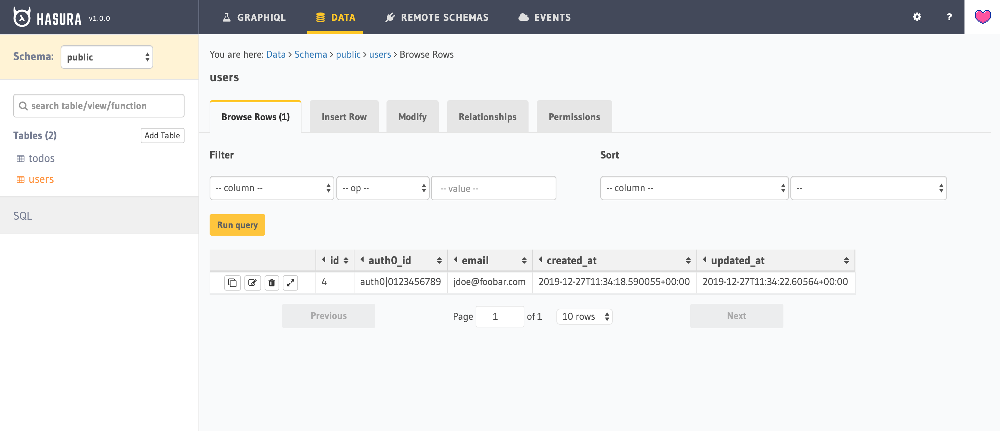
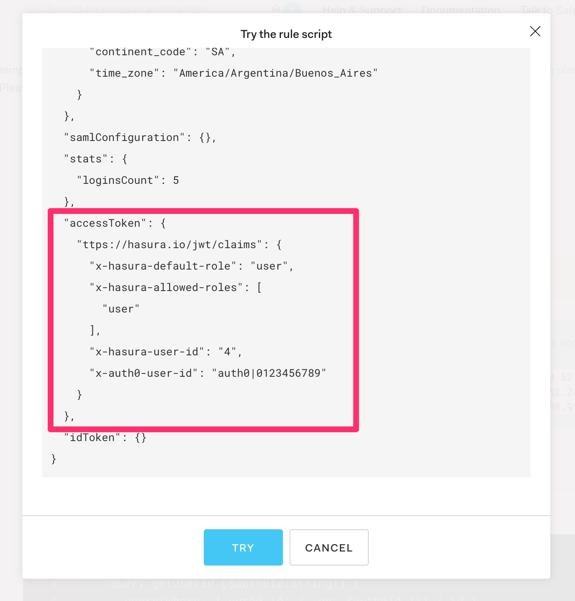
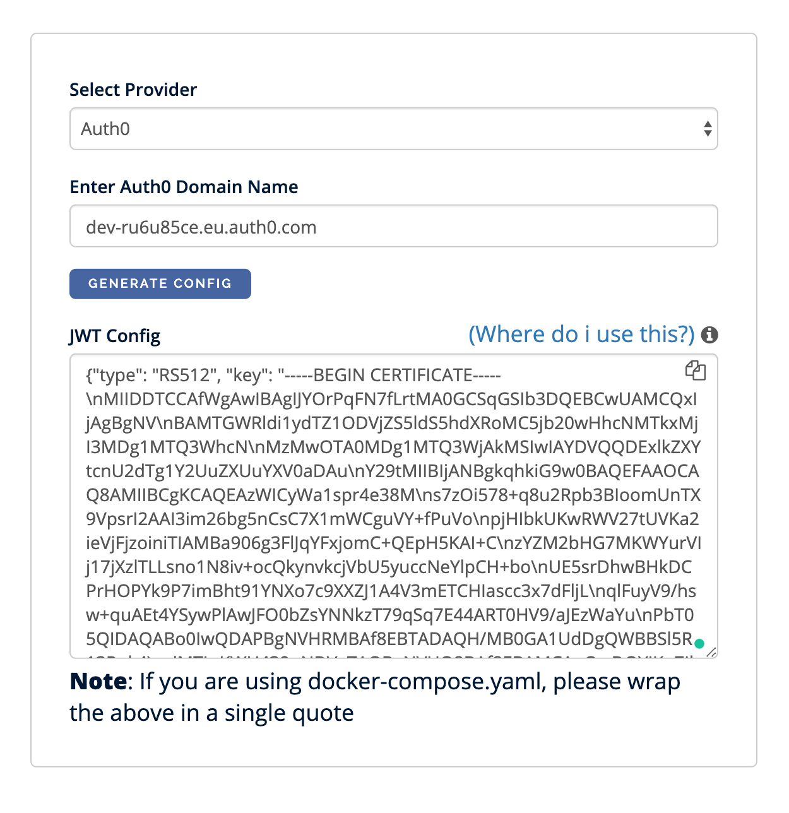

## Overture

I've been struggling to put together the pieces of documentation that you need to have this working properly.

With hindsight, it was an easy-peasy task, but some of the steps are not so straightforward nor sufficiently explained 
in the projects' docs.

By the end of this tutorial you are running a _Full Stack_ app that can signup/login users and persist
user data in a backend service.

## The Main Characters

[Hasura][hasura] is a real time [GraphQL][gql] engine. It sits between your frontend and [PostgreSQL][pg] database 
and build up a schema that **you can easily query from your frontend** project or other services.

Hasura is Open Source and **you can run it entirely for free** thanks to [Docker][docker] (locally
or on premise) and [Heroku][heroku] (on the cloud).

[Auth0][auth0] is a commercial _Authentication/Authorization as a Service_. It handles all your signup/login
logic for you, and it applies top-shelf safety guidelines.

Although Auth0 is not free, they offer a **generous free-tier up to 7k users** to kick-start your project, and later
on the pricing model is decent. It definitely costs less than maintaining an engineer that focuses on safety!

## The Plot

Here is a brief list of the steps that you are going to take in order to get things up and running:

1. Setup an Auth0 Account & App
2. Setup an Hasura App on [Heroku][heroku]
3. Prepare your backend with users and todos endpoints
4. Configure Auth0 to sync users with Hasura
5. Configure Auth0 to generate an Hasura compatible authentication token ([JWT][jwt])

## Setup an Auth0 Account & App

Head to [Auth0][auth0] home page and signup using one of the available social signup. 

Once you are in, you need to go through a few configuration steps that **setup your first tenant**.
You can consider _tenant_ as a bucket of users, give or take, you will use a new tenant for a new project.

Now you are ready to setup your first app:

1. Go to "Applications -> Default App -> Quick Start"
2. Choose the "Single-Page App -> React" combination
3. Follow the tutorial how to set up your Auth0 App
4. Download the demo app and run it to test it

**👉 IMPORTANT:** Auth0 comes pre-configured with a generic Google login. Although this will work out of the box,
you will notice that **your app looses the login status at every full-page refresh**. This happens because you 
should fully configure the connection between Google and Auth0 by creating a Google App ID and secret. 

This configuration is out of the scope of this tutorial, and I simply suggest to use the email/password signup/login.
That will work just fine 😀.

## Setup an Hasura App on Heroku

This step consists in following the ufficial documentation from the Hasura website:  
https://docs.hasura.io/1.0/graphql/manual/getting-started/heroku-simple.html

I feel this is a **great quick start experience** with the "Deploy to Heroku" button:

1. From the documentation page click on "Deploy to Heroku"
2. Choose you App's name and region
3. Click on "Deploy App" (wait a minute or two)
4. Click on "View App" to open the Hasura dashboard 🤪

Can anything be easier than that?  
I don't think so!

**👉 IMPORTANT:** After you play around with some [basic Hasura introduction tutorials][hasura-basics], I strongly suggest you go through the
[Securing the GraphQL endpoint tutorial][hasura-secret].

_That's all Folks!_ before you move on, I suggest you play around with some basic Hasura tutorials how to build
tables, perform queries and mutations. 

Also you may want to take a read on [Hasura's Authentication and Authorization][hasura-auth] in order to familiarize
with the concept of the [JWT token][jwt] used in the request's headers. It is not a bad idea to play around with 
it to the point that you can manually generate a token on jwt.io and use it to perform some user-level queries.

## Prepare your backend with Users and Todos endpoints

This step requires you to login into your new Hasura dashboard and prepare your backend to handle:

- User synchroniation between Auth0 and Hasura
- User based queries (aka: Hasura authorization on the Todos table)

### Prepare the Users

The **users table** will store all the signups and logins.

Go to "Data -> Create Table" and create a table named "users":

- id, integer, auto-increment, primary
- auth0_id, text, **unique**
- email, text
- created_at, timestamp
- updated_at, timestamp



### Prepare the Todos

The **todos table** will store a list of tasks that need to be performed for each user.

👉 The final goal is to login as a user and make sure that she can access only her own todos!

Go to "Data -> Create Table" and create a table named "todos":

- id, integer, auto-increment, primary
- user_id, integer
- text, text

For this table you are also going to modify the "Permissions" adding a new role and set it up so to
restrict any `SELECT *` statement to a sub-group of rows filtered by the `user_id`:



**NOTE:** be sure that you select all the columns under "Column select permission" panel:



### Test Todos Permissions

In order to verify that the permissions setup work as expected I suggest you test it out before you proceed any further.

**Step 1:** add some todos with different `user_id` values using the "Data -> todos -> Insert Row" utility:


**Step 2:** simulate a role base query using the Hasura's Graphiql UI:



Once everything works as expected, you can move on to the next step.

## Configure Auth0 to sync users with Hasura

In this step you are going to **write an Auth0 rule** that is capable of 
**syncing data from Auth0 to the Hasura's users table** every time a user authenticates.

From your Auth0 dashboard head to "Rules -> Create Rule" and select "Empty Rule" as template, 
name the rule "sync user to hasura" and paste the following code into it:

```js
function syncUserToHasura (user, context, callback) {
  const query = `
    mutation($userId: String!, $email: String) {
      insert_users(
        objects: [{
            auth0_id: $userId
            email: $email
        }],
        on_conflict: {
            constraint: users_auth0_id_key,
            update_columns: [updated_at]
        }) {
            affected_rows
      }
    }
  `;

  const variables = {
    userId: user.user_id,
    email: user.email,
  };

  const payload = {
    headers: {
      "content-type": "application/json",
      "x-hasura-admin-secret": configuration.ACCESS_KEY
    },
    url: `${configuration.BASE_URL}/v1/graphql`,
    body: JSON.stringify({ query, variables }),
  };

  request.post(payload, (error, response, body) => callback(error, user, context));
}
```

This piece of code works more or less as a _Lambda function_ and simply sends a mutation to your Hasura backend
to create or update a _users table_ row using values from the Auth0 context.

You may have noticed that there are 2 variables that looks awfully like _environment variables_:

- `configuration.BASE_URL`
- `configuration.ACCESS_KEY`

In order to configure the correct values, go back to "Auth0 -> Rules" and scroll toward the bottom of the page
until you find the "Settings" panel:



Now add your Hasura's base url (mine looks like: `https://hasura-article.herokuapp.com/`) and secret, then you can
go back into your rule an click on "TRY THIS RULE" at the bottom of the page.

If everything goes as planned, you should be able to see a new _users table_ line:



With this rule in place, you should be able to pick up your local React App, login again (or just refresh the page) and
then refresh the Hasura's users table and see your logged in user succesfully stored there!

## Configure Auth0 to generate an Hasura compatible JWT

So far you can login/logout using a locally developed React app and you can store your user's data into your
Hasura's backend _users_ table. The next step is to use the login credentials to **perform some user-scoped queries** from the React App. 

**By all means, if you login as "Peter" you should see Peter's todos.**

This operation requires you to operate in multiple areas:

1. Configure an Auth0 rule so to generate an Hasura compatible JWT claims
2. Use an Auth0 API to force the JWT Auth Token
3. Configure Hasura to validate Auth0 generated JWTs

### Step 1 - Add Hasura's JWT claims

Let's create a new generic rule from "Auth0 -> Rules", name it "hasura jwt claim" and paste this code:

```Javascript
function hasuraClaimsRule (user, context, callback) {
  const query = `
		query getUserId ($auth0Id:String!) {
			users(where: { auth0_id: { _eq: $auth0Id }}) { id }
    }
  `;

  const variables = {
    auth0Id: user.user_id,
  };

  const payload = {
    headers: {
      "content-type": "application/json",
      "x-hasura-admin-secret": configuration.ACCESS_KEY
    },
    url: `${configuration.BASE_URL}/v1/graphql`,
    body: JSON.stringify({ query, variables })
  };

  request.post(payload, (error, response, body) => {
    if (error) {
      callback(error);
      return;
    }

    try {
      context.accessToken['https://hasura.io/jwt/claims'] = {
        "x-hasura-default-role": "user",
        "x-hasura-allowed-roles": ["user"],
        "x-hasura-user-id": JSON.parse(body).data.users[0].id.toString(),
        "x-auth0-user-id": user.user_id,
      };

      callback(null, user, context);
    } catch (err) {
      callback(err);
    }
  });
}
```


Once you try this rule, it will use Auth0's user identifier to retrieve Hasura's internal `user_id` and store it
into the JWT claims. You should be able to see a log like this one:



This rule is very important as you want to establish all your internal data relations using simple integers to
improve performances, also, you don't really want to spread the long Auth0 id as foreign key all over your database!

### Step 2 - Use a custom API

Now we are going to address a special _SPA Application_ issue:  
**Where in hell should we store the JWT token?**

Luckily, Auth0 SDK provides a simple solution:  
**do not store it**. 

The SDK comes prepared with a utility function `client.getTokenSilently()` that will give you access to the original
`access_token`. **The problem is that by default Auth0 will not hand out a JWT**, and this is the point where it gets
very confusing with the available documentation!

The solution is quite simple. 

Add an `audience` claim to `Auth0Provider` in `src/index.js`:

```js
...
ReactDOM.render(
  <Auth0Provider
    domain={config.domain}
    client_id={config.clientId}
    audience={'https://dev-ru6u85ce.eu.auth0.com/api/v2/'}
    ...
```

The value comes from "Auth0 -> APIs" page, and you can simply copy the "API Audience" value of the default API.

**NOTE:** There is so much more stuff to do with Auth0's APIs, but that deserve its own tutorial! Today let's just
scratch the surface with the default API.

With the _audience_ set up, you can now create a `src/components/Todos.js` component that will attempt to load
the todos that belong to the authenticated user:

```js
import React, { useEffect, useState } from 'react';
import { useAuth0 } from "../react-auth0-spa";

const Todos = () => {
  const { isAuthenticated, getTokenSilently } = useAuth0();
  const [todos, setTodos] = useState([]);

  useEffect(() => {
    const loadTodos = async () => {
      const token = await getTokenSilently();
      const body = await (await fetch('https://hasura-article.herokuapp.com/v1/graphql', {
        method: 'POST',
        headers: {
          'Content-Type': 'application/json',
          'Authorization': `Bearer ${token}`,
        },
        body: JSON.stringify({ query: 'query { todos { id, text }}' }),
      })).json();

      if (body.errors) {
        console.error(body.errors[0].message)
      } else {
        setTodos(body.data.todos)
      }
    }

    isAuthenticated && loadTodos()
  }, [isAuthenticated, getTokenSilently])

  return (
    <ul>
      {todos.map(todo => (
        <li key={todo.id}>{todo.text}</li>
      ))}
    </ul>
  )
};

export default Todos;
```

But if you add this to your `src/App.js` it will `console.error` "invalid x-hasura-admin-secret/x-hasura-access-key"
because we haven't yet set up Hasura so to be able to verify the JWT produced by Auth0. That is the next step.

### Step 3 - Configure Hasura to validate Auth0 generated JWTs

In this step you are going to generate a piece of Hasura configuration that will enable the JWT Authentication.

First, go to https://hasura.io/jwt-config, select "Auth0" provider and paste the "domain name" as in `src/auth_config.json`
(or you can copy it from your "Auth0 -> Apps -> Default App -> Settings").



Now copy the generated configuration and navigate to "Heroku -> Application -> Settings" and add a new config variable
`HASURA_GRAPHQL_JWT_SECRET` to which you apply that huge config value.

In a few seconds, possibly a minute, your Hasura backend will be up and running with the new configuration, and your
todos will be visible in the client app, just make sure that you manually insert a few todos with the correct `user_id`.

## Conclusions

This tutorial covers the basiscs of integrating Hasura, Auth0 and a React SPA.

From this starting point, you should be able to use tools like [Apollo Client][apollo-client] to build the data-layer
of your frontend App.


[hasura]: https://hasura.io "Real Time GraphQL Engine"
[gql]: https://graphql.org "GraphQL"
[pg]: https://www.postgresql.org "PostgreSQL"
[auth0]: https://auth0.com "Authentication Authorization as a Service"
[docker]: https://docker.com "Docker Container Runner"
[heroku]: https://heroku.com "Cloud Application Platform"
[gitpod]: https://gitpod.io "Cloud IDE"
[jwt]: https://jwt.io "JSON Web Token"
[hasura-basics]: https://docs.hasura.io/1.0/graphql/manual/getting-started/first-graphql-query.html
[hasura-secret]: https://docs.hasura.io/1.0/graphql/manual/deployment/heroku/securing-graphql-endpoint.html
[hasura-auth]: https://docs.hasura.io/1.0/graphql/manual/auth/index.html
[apollo-client]: https://www.apollographql.com/docs/react/
