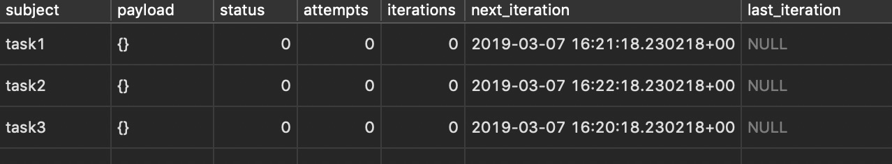
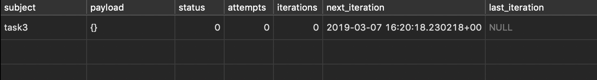
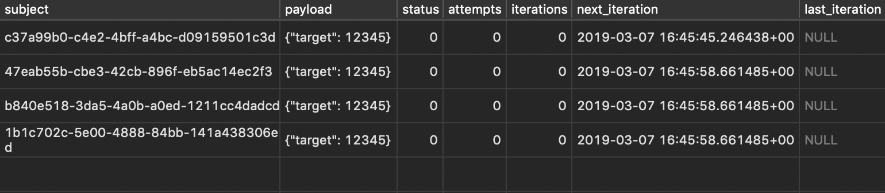
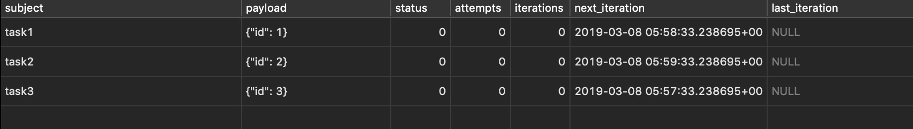

Here is some SQL knowledge that I collected while working at the [FetchQ](https://fetchq.com) project, a **queue service** that leverages the power of
[PostgreSQL](https://www.postgresql.org/) to **handle millions of tasks** whithout 
breaking a sweat, even on small servers.

It took some struggling months to get to an efficient system. But in the end we managed
to run a cluster of over 100 EC2 machines that were harvesting data using FetchQ.

Plus today I embed FetchQ in almost every project and I use it to split my backend
architecture in what I use to call "Lamba functions on Docker".

---

## Smart schema for task picking

The first step toward an efficient system is a good schema.  
Here is what we came up with:

field          | type     | description
-------------- | -------- | -----------
subject        | string   | (unique) task identifier
payload        | jsonb    | task's meta info, like a cookie for the task
status         | integer  | see later
attempts       | integer  | number of times that the task failed
iterations     | integer  | number of successful iterations
next_iteration | datetime | planning and locking date
last_iteration | datetime | last picking date

    CREATE TABLE tasks (
        subject character varying(50) PRIMARY KEY,
        payload jsonb DEFAULT '{}',
        status integer DEFAULT 0,
        attempts integer DEFAULT 0,
        iterations integer DEFAULT 0,
        next_iteration timestamp with time zone,
        last_iteration timestamp with time zone
    );

And let's populate some dummy data into it:

    INSERT INTO tasks (subject, next_iteration) VALUES
    ('task1', NOW()),
    ('task2', NOW() + INTERVAL '1 minute'),
    ('task3', NOW() - INTERVAL '1 minute');

### Pick Next Task For Execution:

The whole idea is to be able to pick the oldest task from the list:

    SELECT * FROM tasks
    WHERE next_iteration <= NOW()
    AND attempts < 5
    ORDER BY next_iteration ASC, attempts ASC
    LIMIT 1;

And update this task right away so that other processes won't get it:

    UPDATE tasks SET
    attempts = attempts + 1,
    next_iteration = NOW() + INTERVAL '5 minutes'
    WHERE subject = 'task3';

### Complete a Task:

When the process is done with the task it should run a new `update` so
to schedule this task for a new execution:

    UPDATE tasks SET
    attempts = 0,
    iteration = iteration + 1,
    last_iteration = NOW(),
    next_iteration = NOW() + INTERVAL '1 year'
    WHERE subject = 'task3';

Or simply delete the task if there is no need for repetition:

    DELETE FROM tasks WHERE subject = 'task3';

### What is so cool about this schema?

There are a couple of things about it. For start we combine the `next_iteration``
and `attempts` to pick the **oldest possible scheduled task** that has not failed
too many times.

This simple query allows for an **error tolerance strategy** that has its core in the
number of attempts that we query for. 

We also sort the tasks based on the attempts so to give priority to tasks that have
failed less.

The update that we perform after the picking is also interesting because it will
**optimistically set the `next_execution` date 5 minutes in the future**. This way we
effectively lock the task for 5 minutes (or a custom value) to prevent other processes
to pick it.

If shit hits the fan and the process that is handling the task dies, **the task
will be given another go in no less than 5 minutes**. This will also achieve a time
spaced attempts to re-work a specific task, which is quite important in case we are
scraping data, dealing with HTTP requests that may go temporarly wrong.

In case the process completes the task with success, it will either schedule it for
a next execution, or simply drop the task.

### Why is the Subject a Primary Key?

Well... any table need a primary id. So I figured that using the task identifier as
primary key would solve the problem, and also achive my goal to avoid tasks repetition.

If I want to put multiple tasks with the same target I will use the payload:

    CREATE EXTENSION IF NOT EXISTS "uuid-ossp";
    
    INSERT INTO tasks (subject, payload, next_iteration) VALUES
    (uuid_generate_v4(), '{"target":12345}', NOW()),
    (uuid_generate_v4(), '{"target":12345}', NOW()),
    (uuid_generate_v4(), '{"target":12345}', NOW());

---

## Select for Update

The problem with this solution is that in a **higly competitive environment** where many
consumers try to pick a new task to process things can go wrong.

**Some time** will pass between the `SELECT` and the `UPDATE` for locking. Probably
it's milliseconds, but it is still enough to cause multiple consumers to receive the
same task. That's no good.

> It's important to understand that **you will never experience any problem during 
> development** because you are likely running one single process that consumes 
> the queue. That's why is always good to simulate a production run. Using `Docker` 
> it gets quite easy to spin up multiple copies of the same process, hence simulating
> a distributed queue processing system.

### We need a quick way to lock the tasks

And luckily Postgres has a very simple solution: `SELECT ... FOR UPDATE`.

Step number one is to add an **optimistic lock** on the rows that are affected
by the task picking select:

    SELECT * FROM tasks
    WHERE next_iteration <= NOW()
    AND attempts < 5
    ORDER BY next_iteration ASC, attempts ASC
    LIMIT 1
    FOR UPDATE;

The last instruction simply gets the job done. But this is still just half of it
because this **optimistic lock** will not last across different transactions
(aka queries).

Somehow we need to run the update query right after the select.  
Again, Postgres is just so cool:

    UPDATE tasks SET 
        attempts = attempts + 1,
        next_iteration = NOW() + INTERVAL '5 minutes'
    WHERE subject IN (
        SELECT subject FROM tasks
        WHERE next_iteration <= NOW()
        AND attempts < 5
        ORDER BY next_iteration ASC, attempts ASC
        LIMIT 1
        FOR UPDATE FOR UPDATE SKIP LOCKED
    ) RETURNING subject;

This query will give you a list of subjects (based on `LIMIT`) that **have been
already locked** with the `next_iteration` mechanism. No other queries, no matter
how close in time, will ever get the same subjects.

**This query effectively solves the distributed processing problem**. From now on
the amount of parallel queue consumers simply depends on how many concurrent 
connections are supported by your Postgres server. We succesfully run > 100 clients
on a quite small (AWS t2.medium) machine.

But apparently we lost the ability to retrieve the full row! No worries, we can
further improve the picking query to fix that problem:

    WITH picked_tasks AS (
        UPDATE tasks SET 
            attempts = attempts + 1,
            next_iteration = NOW() + INTERVAL '5 minutes'
        WHERE subject IN (
            SELECT subject FROM tasks
            WHERE next_iteration <= NOW()
            AND attempts < 5
            ORDER BY next_iteration ASC, attempts ASC
            LIMIT 1
            FOR UPDATE FOR UPDATE SKIP LOCKED
        ) RETURNING subject
    )
    SELECT * FROM tasks 
    WHERE subject IN (SELECT subject FROM picked_tasks);

And this is the first big piece of Postgres knowledge that unlocked the possibility
for real parallel queue processing without wasting CPU on duplicate jobs.

---

## On Conflict Do Nothing

With many machines processing the queue I was then able to generate a greater 
amount of data to process.

My scraper engine works on multiple queues, where each task in `Q1` can generate
many (a lot) of tasks for `Q2`. I soon hit a huge wall when it comes to
**push many new documents into a queue**.

My document pushing query was:

    INSERT INTO tasks (subject, next_iteration) VALUES
    ('task1', NOW()),
    ('task2', NOW() + INTERVAL '1 minute'),
    ('task3', NOW() - INTERVAL '1 minute');

And it worked well as long the subjects are new to the queue. In case they are not
the entire query fails.

In my ingenuity I resolved to this:

    for (const task in candidates) {
        const q = `SELECT subject FROM tasks WHERE subject = '`${task}`' LIMIT 1`
        const exists = await query();
        if (!exists) {
            await query("INSERT INTO ...")
        }
    }

Things got promptly worse as the CPU sky rocketed and my db machined begged me to
put an end to her suffering.

In retrospective I feel quite silly to just have came up with that monstruosity:
**2 queries to push 1 document, when I clearly needed 1 query
to push hunderds documents!**

Again I turned to Google and again he provided an answer (but it must be said that
he doesn't give it away so easily!):

    INSERT INTO tasks (subject, next_iteration) VALUES
    ('task1', NOW()),
    ('task2', NOW() + INTERVAL '1 minute'),
    ('task3', NOW() - INTERVAL '1 minute')
    ON CONFLICT DO NOTHING;

This simple change in the bulk insert will tell Postgres to **simply ignore any
possible error**, just keep inserting what it can be inserted.

## Upserting in Postgres

A side effect of the `ON CONFLICT ... DO ...` is the possibility to perform
efficient upserts queries.

> You perform an `UPSERT` when you try to `INSERT` a record, it fails because
> of a constrain, so then you resolve to `UPDATE` the existing record with new
> data.

Something like this:

    try {
        await query(`INSERT INTO tasks (subject, payload) VALUES ('t1', '{"a":1}'`)
    } catch (err) {
        await query(`UPDATE tasks SET payload = '{"a":1}'`) WHERE subject = 't1'`)
    }

But performed in one single efficient query:

    INSERT INTO tasks
        (subject, payload, next_iteration)
    VALUES
        ('task1', '{"a":1}', NOW()),
        ('task2', '{"a":2}', NOW() + INTERVAL '1 minute'),
        ('task3', '{"a":2}', NOW() - INTERVAL '1 minute')
    ON CONFLICT (subject) DO
    UPDATE SET
        payload = EXCLUDED.payload,
        next_iteration = EXCLUDED.next_iteration;

You can also ask Postgres to give you back a full report on the affected rows
with a `RETURNING` statement:

    INSERT INTO tasks
        (subject, payload, next_iteration)
    VALUES
        ('task1', '{"a":1}', NOW()),
        ('task2', '{"a":2}', NOW() + INTERVAL '1 minute'),
        ('task3', '{"a":2}', NOW() - INTERVAL '1 minute')
    ON CONFLICT (subject) DO
    UPDATE SET
        payload = EXCLUDED.payload,
        next_iteration = EXCLUDED.next_iteration
    RETURNING *;

---

## You can't SELECT COUNT(*)

This is a problem without a real solution. Or at least I couldn't find any real
solution out of a lot of Googling.

Say I want to know how many "pending" documents I have in my queue. A "pending"
document is a document who's `next_iteration` data is in the past. This information
is critical because **it measure the accumulated work**. If it's too much I may have
to add new clients and scale horizontally:

    SELECT COUNT(subject) FROM tasks
    WHERE next_iteration < NOW();

I may want to know how many "work in progress" documents I have:

    SELECT COUNT(subject) FROM tasks
    WHERE next_iteration BETWEEN NOW() AND NOW() + INTERVAL '5 minutes';

Anyway here is the **list of metrics** that I would like to monitor about a
specific queue:

    -- METRIC: total queue size
    SELECT COUNT(subject) FROM tasks;

    -- METRIC: pending
    SELECT COUNT(subject)
    FROM tasks WHERE next_iteration < NOW()
    AND attempts < 5;

    -- METRIC: planned
    SELECT COUNT(subject)
    FROM tasks WHERE next_iteration > NOW()
    AND attempts = 0;

    -- METRIC: work in progress
    SELECT COUNT(subject) FROM tasks
    WHERE next_iteration BETWEEN NOW() AND NOW() + INTERVAL '5 minutes'
    AND attempts < 5;

    -- METRIC: dead documents
    SELECT COUNT(subject) FROM tasks
    WHERE attempts >= 5;

The problem is that **those queries become excruciatingly slow** once you start to
handle few million documents inside the queue table.

That happens because **`SELECT COUNT` forces a _full scan_** on the table.
Postgres need to walk record by record and match it against the query, the
poor guy can't use any of the fancy tricks that he is used to!

---

## Log Counters & Squeeze

A possible solution to the `SELECT COUNT` problem is to keep track of the different
metrics on the go, with a simple metrics table like this one:

field          | type     | description
-------------- | -------- | -----------
metric         | string   | (unique) metric identifier
value          | integer  | current metric value

    CREATE TABLE metrics (
        metric character varying(50) PRIMARY KEY,
        amount integer DEFAULT 0
    );

At this point we can upsert on this table with variations. Say we want to track
5 new documents that were pushed into the queue:

    INSERT INTO metrics AS t (metric, amount)
    VALUES ('size', 5 )
    ON CONFLICT (metric) DO
    UPDATE SET amount = t.amount + EXCLUDED.amount
    RETURNING *;

NOTE: You can run this query with a value `-5` to run a decrement.

Now the problem is that we have some pretty complex oprations that we want to
perform. When we pick a new task for execution we would need to
**increment a "wip" counter** and **decrement a "pending" counter**.

Is that possible? Of course it is. The "picking query" can be improved and
enriched with the metrics side effects:

    WITH
    pick_tasks AS (
        UPDATE tasks SET 
            attempts = attempts + 1,
            next_iteration = NOW() + INTERVAL '5 minutes'
        WHERE subject IN (
            SELECT subject FROM tasks
            WHERE next_iteration <= NOW()
            AND attempts < 5
            ORDER BY next_iteration ASC, attempts ASC
            LIMIT 1
            FOR UPDATE FOR UPDATE SKIP LOCKED
        ) RETURNING subject
    ),
    increment_wip AS (
        INSERT INTO metrics AS t (metric, amount)
        SELECT 'wip', (SELECT COUNT(subject) FROM pick_tasks)
        ON CONFLICT (metric) DO
        UPDATE SET amount = t.amount + EXCLUDED.amount
    ),
    decrement_pnd AS (
        INSERT INTO metrics AS t (metric, amount)
        SELECT 'pnd', 0 - (SELECT COUNT(subject) FROM pick_tasks)
        ON CONFLICT (metric) DO
        UPDATE SET amount = t.amount + EXCLUDED.amount
    )
    SELECT * FROM tasks WHERE subject IN (SELECT subject FROM pick_tasks);

And a similar job can be done with the "complete task" query:

    WITH
    completed_tasks AS (
        UPDATE tasks SET 
            attempts = 0,
            iterations = iterations + 1,
            next_iteration = NOW() + INTERVAL '1 year'
        WHERE subject IN (
            SELECT subject FROM tasks
            WHERE subject = 'task3'
            LIMIT 1
            FOR UPDATE FOR UPDATE SKIP LOCKED
        ) RETURNING *
    ),
    increment_pln AS (
        INSERT INTO metrics AS t (metric, amount)
        SELECT 'pln', (
            SELECT COUNT(subject) FROM completed_tasks
            WHERE next_iteration > NOW()
        )
        ON CONFLICT (metric) DO
        UPDATE SET amount = t.amount + EXCLUDED.amount
    ),
    increment_pnd AS (
        INSERT INTO metrics AS t (metric, amount)
        SELECT 'pnd', 0 - ((
            SELECT COUNT(subject) FROM completed_tasks
        ) - (
            SELECT COUNT(subject) FROM completed_tasks
            WHERE next_iteration < NOW()
        ))
        ON CONFLICT (metric) DO
        UPDATE SET amount = t.amount + EXCLUDED.amount
    )
    SELECT * FROM tasks WHERE subject IN (SELECT subject FROM completed_tasks);

Now, a big challenge regards how to deal with counters when we push new documents
into the queue. Using the bulk insert we can add an **eteroreneous list of tasks**
that are mixed between "pending" and "planned".

We should look into each new document and update a counter based on `next_iteration``
date. That might end up being extremely expensive for massive bulk insert:

    WITH
    inserted_tasks AS (
        INSERT INTO tasks (subject, payload, next_iteration) VALUES
        ('task1', '{"id":1}', NOW()),
        (uuid_generate_v4(), '{"id":2}', NOW() + INTERVAL '1 minute'),
        (uuid_generate_v4(), '{"id":3}', NOW() - INTERVAL '1 minute')
        ON CONFLICT (subject) DO NOTHING
        RETURNING *
    ),
    increment_pln AS (
        INSERT INTO metrics AS t (metric, amount)
        SELECT 'pln', (
            SELECT COUNT(subject) FROM inserted_tasks
            WHERE next_iteration > NOW()
        )
        ON CONFLICT (metric) DO
        UPDATE SET amount = t.amount + EXCLUDED.amount
    ),
    increment_pnd AS (
        INSERT INTO metrics AS t (metric, amount)
        SELECT 'pnd', (
            SELECT COUNT(subject) FROM inserted_tasks
            WHERE next_iteration <= NOW()
        )
        ON CONFLICT (metric) DO
        UPDATE SET amount = t.amount + EXCLUDED.amount
    )
    SELECT * FROM inserted_tasks;

It might get even more tricky in case we want to **handle the bulk upserts** because
the counters need to be incremented or decremented based on both previous and current
value of `next_iteration` data. Here is a possible implementation:

    WITH
    all_docs (subject, payload, next_iteration) AS (
        VALUES
        ('task1', '{"id":1}', NOW() - INTERVAL '1 month')
    ),
    inserted_docs AS (
        INSERT INTO tasks (subject, payload, next_iteration)
        SELECT subject, payload::jsonb, next_iteration FROM all_docs
        ON CONFLICT (subject) DO NOTHING
        RETURNING *
    ),
    skipped_docs AS (
        SELECT
            _source.*, 
            _values.payload AS payload_new,
            _values.next_iteration AS next_iteration_new,
            _source.next_iteration AS next_iteration_old
        FROM tasks as _source
        JOIN all_docs AS _values ON _source.subject = _values.subject
        WHERE _source.subject NOT IN (SELECT subject FROM inserted_docs)
        FOR UPDATE FOR UPDATE SKIP LOCKED
    ),
    updated_docs AS (
        UPDATE tasks
        SET
            payload = _value.payload_new::jsonb,
            next_iteration = _value.next_iteration_new
        FROM (
            SELECT * FROM skipped_docs
        ) AS _value
        WHERE tasks.subject = _value.subject
        RETURNING _value.*
    ),
    increment_pln AS (
        INSERT INTO metrics AS t (metric, amount)
        SELECT 'pln', (
            (
                SELECT COUNT(subject) FROM inserted_docs
                WHERE next_iteration > NOW()
            )
            +
            (
                SELECT COUNT(subject) FROM updated_docs
                WHERE next_iteration_old <= NOW()
                AND next_iteration_new > NOW()
            )
            -
            (
                SELECT COUNT(subject) FROM updated_docs
                WHERE next_iteration_old > NOW()
                AND next_iteration_new <= NOW()
            )
        )
        ON CONFLICT (metric) DO
        UPDATE SET amount = t.amount + EXCLUDED.amount
    ),
    increment_pnd AS (
        INSERT INTO metrics AS t (metric, amount)
        SELECT 'pnd', (
            (
                SELECT COUNT(subject) FROM inserted_docs
                WHERE next_iteration <= NOW()
            )
            +
            (
                SELECT COUNT(subject) FROM updated_docs
                WHERE next_iteration_old > NOW()
                AND next_iteration_new <= NOW()
            )
            -
            (
                SELECT COUNT(subject) FROM updated_docs
                WHERE next_iteration_old <= NOW()
                AND next_iteration_new > NOW()
            )
        )
        ON CONFLICT (metric) DO
        UPDATE SET amount = t.amount + EXCLUDED.amount
    ),
    results AS (
        SELECT
            'updated' AS action,
            t1.subject,
            t1.payload,
            t1.status,
            t1.attempts,
            t1.iterations,
            t1.next_iteration,
            t1.last_iteration
        FROM updated_docs AS t1
        UNION ALL
        SELECT
            'created' AS action,
            t2.subject,
            t2.payload,
            t2.status,
            t2.attempts,
            t2.iterations,
            t2.next_iteration,
            t2.last_iteration
        FROM inserted_docs AS t2
    )
    SELECT * FROM results
    ;

This query combines data so to perform a **bulk insert**, keep track of all the
**skipped records** and merges is with the current available data (note that
we lock those records for an upcaming update), update the values and play with
new/old values to update the counters on "pending" and "planned" data.

Crazy, uh?

But the interesting things don't stop here. This is still quite inefficient when
it comes to play with a lot of documents in the queue table.

---

## Time is NOT a Constant

The problem is that the "picking query" uses a condition that Postgres is not able
to optimize:

    SELECT * FROM tasks WHERE next_iteration <= NOW()

`next_iteration` is a date, and `NOW()` is an **impure function**. Every time we
call this query, `NOW()` will offer a new value, hence we force Postgres to run a
full-scan on the table.

---

## Partial Indexes & Data Partitioning

---

## Maintenance and Triggers

