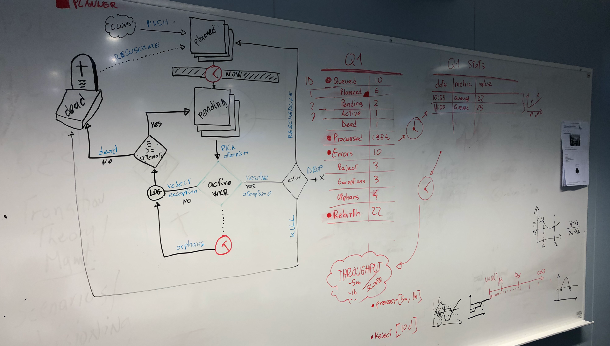

It was the spring of 2018 and my young soon-to-be a co-founder asked me: 

>  Can you download Instagram's influencers?

That's the very beginning of my startup journey as co-founder of [Mysocial.io][mysocial] and  
my answer was a straight:

> NO YOU CAN'T!

Luckily I was wrong, and when I got home that night my brain began to work on the challenge ahead. 

A few months later, we were successfully scraping Instagram, **tracking 4 million influencers on a daily basis**, 
while growing a database of over 100 million Instagram profiles.

This is how [FetchQ][fetchq] came to life. Possibly the most challenging project of my entire career.
And the whole story is available on youtube:

`youtube: https://youtu.be/g8P_w5dyW3c`

Click here for the slides:  
https://www.slideshare.net/marcopeg/fetchq-the-origins

## Queue Systems in Real Life <sup>(tm)</sup>

**Queues are ubiquitous in real life.** Think about the last time you went for a coffee (I live in Sweden and they are
crazy slow coffee makers, so you can bet you'll find a queue there), or just try to enter a 
supermarket during rush hours, what do you see at the cashier? A queue.

The supermarket example is spot-on because it clearly represents the problem that a queue system
helps to mitigate. Let's look into it.

#### It's 15:00 in the afternoon and **the supermarket is empty**:

You pick your stuff and approach the cashier. Only one cashier is open and there is just one guy in front of you.
You are out in just a minute.

#### It's 18:30 in the evening and **it's rush hour**:

You pick up your stuff and approach the cashier.
There are many open lines and you choose the one with the shorter queue.
It takes up to 10 minutes to get out of there.

> In Real Life queues form when the **workload grows faster** than the processing capacity.
> 
> Also, we're used to opening new cashiers during rush hours to **handle a heavier workload** for a short amount of time.

Keep this example in mind while you walk into the software-side of this story!

## Queues in Software Development

A queue system is a to-do list for applications and it normally works like this:

```
---> Feeding the Queue
App1 adds stuff to do into a queue.
App1 adds LOT of stuff to do.

---> Processing the Queue
App2 picks the first item from the queue and processes it.
App2 does it again (and again) until the queue is empty.
```

Often, `App1` is way faster at producing workload than `App2` is at processing. More or less like
a supermarket during rush hours. In such a situation **you can use a _queue system_ to collect the
"pending workload"** and run multiple instances of `App2` to increase the system processing capacity.

Using our supermarket scenario, adding a second cashier is the same as adding another instance of `App2`.

> A queue system helps digesting **massive workload** by distributing it across multiple
> processes or servers.

🤔 But does a queue help only with the heavy lifting?

## Queues to Improve UX

Queues can also be used to **improve the User Experience** by delegating non-critical tasks 
to side processes. 

The signup process is a common situation where UX can benefit from a **queue-oriented architecture**.

The signup's flow looks like this:

1. get data from the request's body
2. apply formal validation (username length, valid email)
3. attempt to create the new user's record into the database
4. **_SEND A WELCOME EMAIL_**
5. return a welcome message to the user

What is the bottleneck here? The email. Sending an email is slow and unreliable.
But it is necessary to give positive feedback to the user and **share critical info** like a confirm link.

Say you own a successful social-network and millions of people sign up. You can control
how fast your validation system is, and you can optimize your database almost at will.

But with emails...no way. It stays slow. Yes, you are going to use external services like
MailGun or Mandrill, still is slow and still can fail.

> Do you really need to hang your users' signup experience **for seconds** just because you `await Mandrill.send(...)`?   
> <small>I don't think so.</small>

A queue system let you re-work the signup flow as:

1. get data from the request's body
2. apply formal validation (username length, valid email)
3. attempt to create the new user's record into the database
4. **_--&gt; QUEUE A WELCOME EMAIL &lt;--_**
5. return a welcome message to the user

**Queuing an email task is fast and reliable**, many queue systems work in memory and they are
insanely fast. [FetchQ][fetchq] works with your Postgres instance and
queuing a new task is as fast as creating the user's record in the `accounts` table.

On the email processing side, you can spin up one (or many) processes/machines whose [single responsibility](srp) is to
process the emails queue, actually sending the emails using Mandrill or whatever service you like best.

This side pipeline **should also be in charge of handling soft errors**, making sure that if the network is
temporarily unavailable, or Mandrill is down for maintenance, we will send out the pending emails later.

## Existing Solutions

As you may guess there are several existing queue systems that you can use off-the-shelf. They aim to
solve the ingest/consumer problem and they aim at handling any arbitrary workload. 

> You can throw [googols](https://en.wikipedia.org/wiki/Googol) of data at them!

If you are running a system that spans into the "billions of tasks" you should
seriously consider one of those services:

[RabbitMQ](https://www.rabbitmq.com/) is an in-memory message broker and you can efficiently use it
to store tasks and distribute it across multiple consumers. It is easy to start with it as it comes
as Docker image that you can spin up in seconds, but it is costly to deploy (you need to cluster it).

[AWS - SQS](https://aws.amazon.com/sqs/) is the off-the-shelf Amazon queue service. As with any AWS service,
this can intake almost any workload that you can think of. And you pay as you go. 
_The more you pay, the more you go._

## Welcome FetchQ

When testing and practicing with existing tools, I hit some dead ends when it comes to a few critical features:

1. RabbitMQ and SQS can't query a queue.
2. it is impossible or very complicated to handle **unique tasks** in a queue.
3. queues are _FIFO_ only, prioritizing tasks is not an easy feat, if possible at all.
4. you simply **can not backup** RabbitMQ or SQS.
5. it's complicated to run e2e tests with mocked states with those systems.

Back then I was working with an incredibly smart guy, but he was very green and I didn't feel like throwing
too many technologies at him all at once. NodeJS + Postgres felt enough.

On top of it, we were trying to scrape Instagram and that means that once you handle a task, **you want to do it
again in the future**, and you probably want to dynamically calculate "when" based on conditions.

Another tricky requirement was that different **tasks should run at different speeds**. Some should run once a day,
others may run once in every blue moon. Again, dynamic conditions.

> Work smarter, not harder!

I can't even start telling you how many times I've heard this quote thinking it's just a cliché.

> This time we really had to implement it. 

We could choose to take in a bunch of different technologies such as
RabbitMQ, Redis and probably Kafka and work hard to wire them together to squeeze out the features we
so desperately needed.

Or we could pick a tool that seemed good enough and **deepen our knowledge** and understanding of it.

Luckily, we chose the latter. 😎

## Postgres to Rescue

[Postgres][postgres] is a DBMS used by gigantic companies to handle unbearable amounts of data. 
We were (naively) aiming to _only_ a few million influencers... It should be enough, right?

Right!

Fast forward a few months, we were now handling **hundreds of millions of tasks in a single small
Postgres instance**. To be totally transparent with you, we were running our DB on an `ec2.m4.medium` instance on AWS
with a 1Tb EBS data disk attached to it. At the same time, **we had 100+ servers connected to that
database** who were consuming and populating many different queues. 🤙

It's been a long uphill road working with indexes, data partitioning, smart constraints, triggers, and notifications.
We hit dead ends and we went back to the drawing board more than once.



But in the very end we did it, and now you can enjoy an Open Source product that can **dramatically change the
way you approach backend development**.

In the next article you will go through the **"FetchQ Hello World"**, a quick tutorial that will guide
you setting up your first queue-based application in just one single NodeJS file.

Curious? Check out these _sandboxes_!  
**You can play with FetchQ online and for free 🙌**

- [FIFO with FetchQ](https://codesandbox.io/s/fetchq-fifo-8xjrg)
- [Async workflow with FetchQ and Fastify](https://codesandbox.io/s/fetchq-workflow-coruu)


[fetchq]: https://fetchq.com "Statefull queue system built on top of Postgres"
[mysocial]: https://mysocial.io "A community for content creators"
[srp]: https://en.wikipedia.org/wiki/Single_responsibility_principle
[postgres]: https://www.postgresql.org "The best database ever"