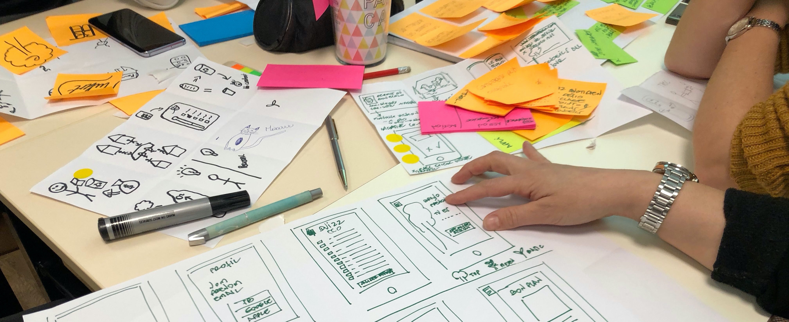

How many times did you hear **"Time To Market"** or **"Timing is King"** during the last year?
I bet you did a lot.

>The truth is:  
**good ideas are cheap and implementation is tricky**

Many people have many good ideas every single day. Less people have the **skills and the resources**
to take an idea to life and create a functioning POC. And even fewer people are able to scale a 
POC to become a stable product that generates recurring revenue.

> Many startups suffer when it's time to scale up

Often, the tech just doesn't hold up: there is too much (technical) debt to be paid, 
onboarding developers becomes a long and tricky journey, and often the founders are the only 
one with a global understanding of the codebase.

**For most of the startups in this position, it is already too late.**  
Luckily, you are reading this article. 😜

## Scaling the Team

Moving from the garage into a real office is arguably the most difficult and expensive of the 
challenges faced by a successful startup. I don't event want to get started with the challenges 
of finding the **good chemistry among team members**, for the sake of simplicity I'm going to 
approach this subject from the technical angle only.

**Every company compete to get senior developers** into their teams because seniors should know 
stuff and should require shorter onboarding time. But seniors are often difficult to find and 
quite expensive. 

On the other hand, juniors are cheaper, widely available and very eager to get their first 
fighting chance to prove themselves. 

> **Juniors are pure gold**  
> <small>(if you know how to handle them)</small>

The main issue with juniors is that they (usually) didn't have time to practice with the almost 
infinite nuances of today's tech stacks. They probably know how to build small apps, but they lack 
the experience to deal with unpredictable fuckups.

If you are in the lucky position of starting up a new project, you can take control of this 
situation and give yourself the freedom of choosing juniors or seniors based on your finances, 
and not the complexity of your stack:

- 👉 Use standard practices for code management
- 👉 Use automation to keep code quality high
- 👉 Use automation to run your stack

[Gitflow](https://www.atlassian.com/git/tutorials/comparing-workflows/gitflow-workflow) is a widely 
adopted code management strategy. It is well documented so you can send your newcomers to 
community-created tutorials, and have them to **learn the process without your direct guidance**.

[Prettier](https://prettier.io/) is a code automation tool that format a source file accordingly
to a set of rules every time you save it. Remember [eslint](https://eslint.org/)? This is its best
buddy. We use _Eslint_ to ensure code quality, and _Prettier_ to automate it.

You can use [Docker](https://www.docker.com/) and _docker-compose_ to describe your entire environment
as source code. And then run it with a simple `docker-compose up` command. This is not an easy feat
to pull off, but once you are there, it's going to take a few minutes to have a new computer
up to speed with your entire system.

If you are not inclined to run stuff on your local machine, of if you can't afford expensive
gears for your team members (quite common during the first period of any startup), you may want to
consider **running your app into a Cloud IDE**.

I'm getting in love with [GitPod](https://gitpod.io) and I'm slowly moving everything there.
(In fact, I'm writing this article from a GitPod workspace.)

> Make it easy  
> Make it repeatable

Regardless of your preferences, my suggestion is to facilitate your team members onboarding by
providing a fully automated and environment where is simple to repeat recurring tasks.

👍 As rule of the thumb, everything that is needed to run the development environment should be
part of the committed codebase.

## Does it work? Don't touch it!

Most of the engineering problems of this world can be solved by 
**blindly applying the following algorithm**:

Besides beign funny, this schema contains two important points:

- ⭐️ Don't touch things that work ⭐️
- 👉 Blame somebody else when things don't work

Is that being crazy? Let me explain.

> Does it work?  
> Don't touch it!

🔸 **_Don't touch things that work_** means that you should choose existing tools that
solve a common problem instead of writing everything from scratch.

It also means that engineers should **focus in creating new value** instead of refining
and refining things that are already doing stuff right. 

Shortly put: 

- 👉 avoid overengineering
- 👉 avoid premature optimization

<small>(Those advices are a classic example of something that is simple, but extremely difficult to practice.)</small>

🔸 **_Blame somebody else when things don't work_** means that you should always be able
to point people to Google for their troubleshooting.

When you choose existing and well adopted tools and strategies, you will enjoy
plenty of existing documentation and Stackoverflow discussions. Most of the times,
it is enough to **copy/paste an error into Google to find a good solution**.

Of course, your product needs some custome code.  
The keyword here is "some":

> Focus on your core value,  
> and let other tools work for you.

- 👉 choose well documented tools
- 👉 choose libraries that are populare on Stackoverflow
- 👉 treat your internal libraries as they were open-source

## SaaS, PaaS and Docker

Let's be honest, **for most of their time, engineers reinvent wheels** that were already
inflated and perfectly circular. Why? Well, sometimes I do that...
just because I can. Just because it's fun or interesting. I'm guilty. Shoot me.

**But there are problems that have been solved already**, like authentication and
authorization. Or storing data and exposing an API. Or like collecting
data to monitor users behaviour, or client/server communication, cache, UI...

> Most of the engineering problems have been solved already!

Here are some tools that solve very common problems:

- [CodeSandbox](https://codesandbox.io/) let you play with backend and frontend while
you learn coding.
- [GitPod.io](https://gitpod.io) gives you a Cloud IDE to work with. 
- [Auth0](https://auth0.com/) or [FusionAuth](https://fusionauth.io/)
remove any burden of signup/login of users. 
- [RDS](https://aws.amazon.com/rds/) or 
[ElephantSQL](https://www.elephantsql.com/) run databases for you. 
- [Hasura](https://hasura.io) generates a full GraphQL API almost on the fly.
- [Apollo Client](https://www.apollographql.com/docs/react/) makes consuming (anc
caching) a GraphQL API a breeze. 
- [Ionic Framework](https://ionicframework.com/) or [MaterialUI](material-ui.com) 
helps building nice UI. 
- [Heroku](https://heroku.com) and [Netlify](https://www.netlify.com/)
make it easy to deploy your app.

Most of those tools **offer free plans** and clear pricing models for the
scale up phase. Many of them are also available as [Docker](https://docker.com)
images and you can easily run them on premise, if you are so inclined.

Let's dive into some layers of the stack, at least, some layers of the stack I love.

## Data Storage

Handling data is important, right? And none of us is really thinking to DIY.
But, do we put a decent amount of time in choosing the right tool for the task ahead?

Many new projects use [MongoDB](https://www.mongodb.com/) 
(_Node+Mongo_ is the new _PHP+MySQL_, right?) and they face
troubles when the data grows. I have nothing against MongoDB, it's an excellent tool
for some usecases (caching?), but it also has caveats that makes it 
**very expensive very fast**, 
[if not completely impossible to deal with](http://www.sarahmei.com/blog/2013/11/11/why-you-should-never-use-mongodb/).

Same thing applyes to [Firebase](https://firebase.google.com/). Firebase is simply
spectacular as a prototying tool and you should definitely try it out.
But [does it scale with your team and your economy?](https://crisp.chat/blog/why-you-should-never-use-firebase-realtime-database/)

Here are a few questions that you may want to ask, before settling for a specific database:

- 👉 How much data are you going to handle during POC phase?
- 👉 What is the monthly data growth, given the product is successfull?
- 👉 How many clients connect directly to the database?

Different databases offer different features / performances and scalability scenario.
You can't choose _SQLite_ if you plan to collect _IOT_ data from millions of devices.

⭐️ My personal choiche for many usecases is [PosgreSQL](https://www.postgresql.org/).

I've started using it a few years ago, and I haven't finished learning it ever since.
It's an amazing tool, and when used right, it challenges you to find its limits!

**Postgres is arguably one of the strongest Open Source Database available today**.
It handles relational and document paradigm. It is fast and reliable. It takes
no memory for small things, and can be optimised to run gigantic amount of data.

I've been using is in a [tough project](https://marcopeg.com/2020/fetchq-introduction)
where over 100 servers were pushing millions of records into a single Postgres
server every few minutes, and that small server didn't even begin to sweat.

With Postgres, you can store both denormalized data (aka: relational tables)
and normalized data (aka: documents). Thanks to triggers and functions you
can build impressive caching layers that leverage after-write normalization.

When a project needs to scale to unreasonable amount of data, which for me means
billions of items in a single collection, then I may decide to introduce
[Cassandra](http://cassandra.apache.org/) or [Redis](https://redis.io/) into
my stack.

But then I must face the price of getting people onboard with them. 

> The more the stack grows, the more space for errors and misusage 
> of unfamiliar tools.

## Frontend

## Deployment

