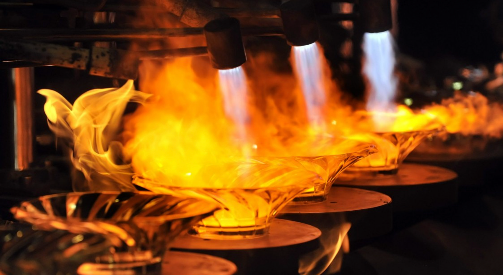
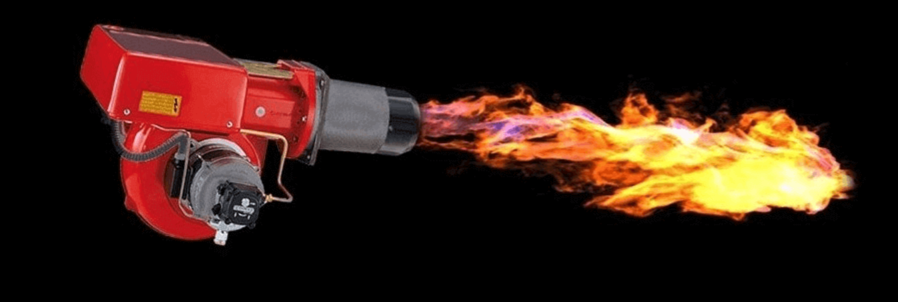

In my teens, I used to work with my dad during the summer. He ran a plumber shop and there was always the need for some help. It was either installing A/C apparatus, or cleaning and fixing heating units in preparation for the next winter.

Back in mid-90', most of the big buildings still used gasoline-fed units. They had a burner and a burning chamber. I'm not going to bore you with technical details, but you need to know that burning gasoline produces a lot of thick black smoke. 

You may have seen this coming out of old trucks on the highway.

***

As you may guess, I was the go-to man to clean up those big dirty monsters, and my dad was very picky about me thorougly cleaning the outside of them, and mopping the floor of the room that hosted them. 

> According to him, I should enter a dark, dusted, blackened room, and leave it as clean as an OR out of Grey’s Anatomy.

To me, that request didn’t make any sense, and I promptly decided that mopping the floor wasn’t truly necessary as long I did clean the heater’s unit itself. After all, my dad raised me to apply critical thinking, always to trust my own judgement.

This decision was taken on the very first day of work of my life, and thanks to me being so uncanny, I finished my duties quite early. 

I was happy and I was proud of myself. 

> To trust is good, to test is best

Later on, my father came to pick me up and promptly manifested his profound concerns in how could I possibly have accomplished the feat of cleaning out so many units, on my first day, so quickly. He must have been really puzzled. 

You need to know that my dad lives by the old saying “to trust is good, to test is best”. So he wanted to check on my work, and I can not blame him for that, given that my critical thinking alwasy led me to break down most of his stuff in my childhood. I guess that raising a curious kid is an expensive business for every parent.

We went down the basement and in no time he angrily erupted: “This place is not clean, the job is not done!”. He was furious, but I got heated up myself to such strong accusation and we started to throw words at each other for a while. Usually, we both heat up quickly, and as quickly we cool down. 

Once done, I’ve genuinely asked: “Dad, the unit is clean and I tested and it’s working fine. What does it matter if the room stay dirty?”. To this very day, I still believe it was a good question, but it took me the better part of the last 30 years to truly understand the answer.

“Son", he told me, "Our customers don’t know anything about heating units, but they pay us good money to clean them. All they can understand is the word “clean”, and if we don’t clean the room, they don’t have any mean to evaluate our job, and ultimately confirm that they spent they money wisely. Cleaning the room is the ultimate service to our customers, so they can be satisfied with the result.”

Of course, he was expressing himself in our local dialect, and something gets lost in the translation from a northern-italian-30-years-ago dialect to modern English... 

Nevertheless, to this very day, I always try my best how to help my customer to evaluate my job, so that they can be fully satisfied for chosing my services after all.

